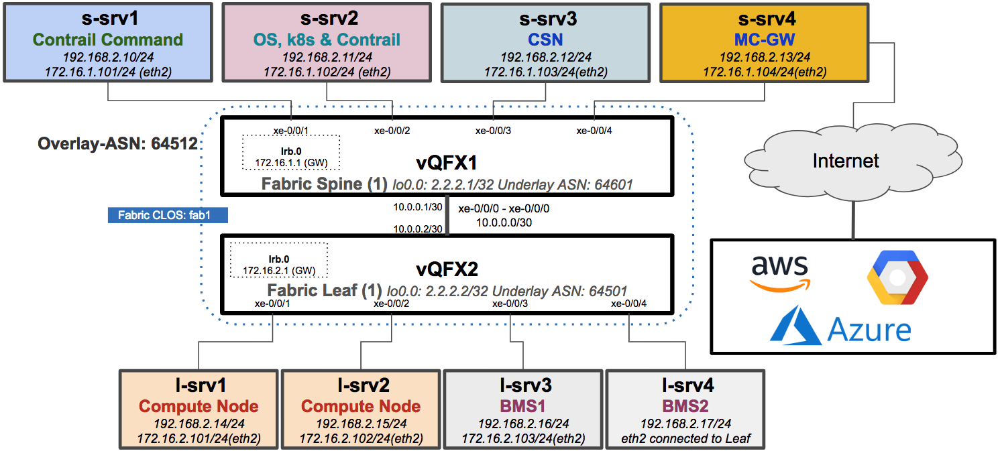
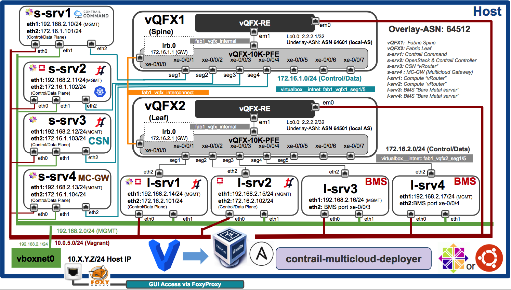
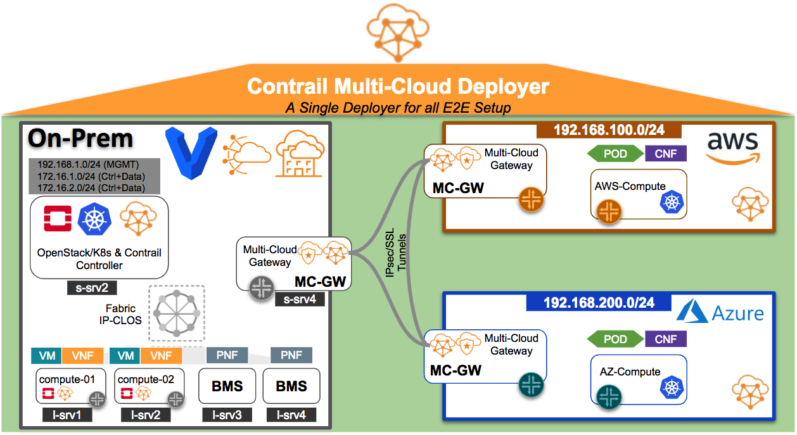

# Contrail Multi-Cloud Vagrant Setup (MC-GW)

Using this repo you can create a whole Multi-Cloud POC setup using Vagrant. The topology is similar to CFM with an addition of new server "s-srv4" on vQFX1 Spine which will be configrued as on-prem MC-GW (Multi-Cloud Gateway) to provide connectivity to Public Cloud AWS and Azure. In this setup on-prem vagrant setup will connect to both AWS and Azure.

Note: Please check high level E2E topology diagram for 

## High Level Vagrant Topology Diagram



## Full Vagrant Topology Diagram



Please note host server will be used for "contrail-multicloud-deployer" for multi-cloud provisioning and prerequisite is docker installing on the host.

## Multi-Cloud E2E Topology Overview




## Bringing Vagrant Setup up

Assumption here is all software (Vagrant/VirtualBox & Ansible) needed for Vagrant setup is already installed and in case you have to setup vagrant host please follow main [README](../README.md) file.

Please use following steps to bring Multi-Cloud Vagrant Topology up.

```bash
host> cd /root
host> git clone https://github.com/qarham/cfm-vagrant.git
host> cd cfm-vagrant/cfm-1x1-vqfx-8srv-mcloud
host> vagrant status

# Now let's print the whole on-prem topology up

host> vagrant up

 ```

## Use-cases Tested on this setup

* ### [UC-01-Contrail_Command_Installation](../docs/multi-cloud/01-Install-Contrail-Command.md)

* ### [UC-02-OpenStack-Contrail-Cluster-Provisioning](../docs/multi-cloud/02-OpenStack-Contrail-Cluster-Provisioning.md)

* ### [UC-03-Contrail-MultiCloud-Provisioning](../docs/multi-cloud/03-Contrail-MultiCloud-Provisioning.md)


