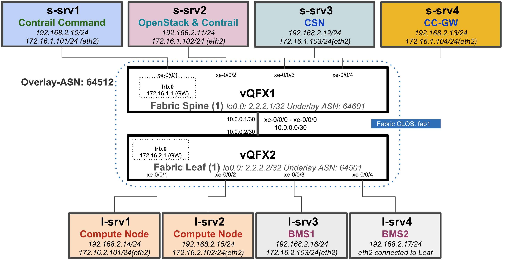
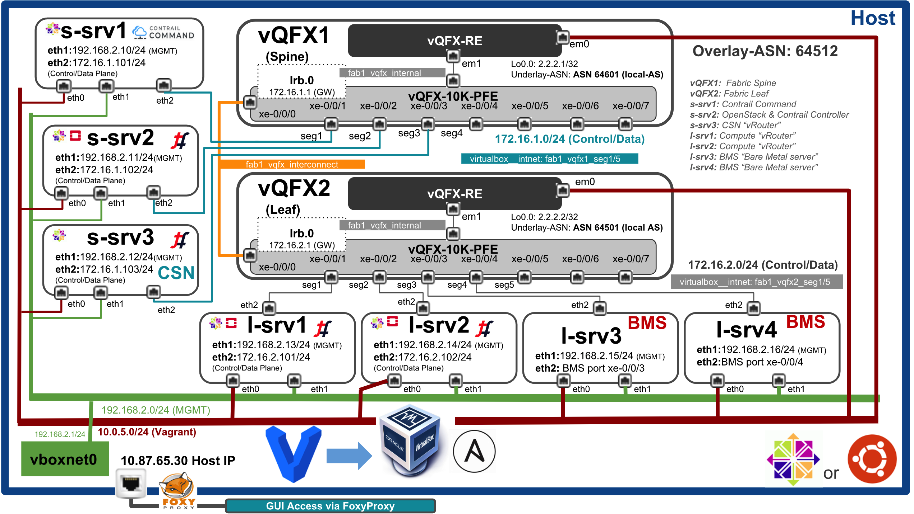

***
This Vagrantfile will spawn 2 instances of VQFX (Full) each with 1 Routing Engine and 1 PFE VM along with 7 nodes connected to 1x1 vQFX Fabric.

# Topology 

## High Level Topology Diagram



## Low Level Detail Topology Diagram



# Provisioning / Configuration

Ansible is used to preconfigured both VQFX with an IP address on their interfaces


# Troubleshooting Tips

After installing VirtualBox on the host "vboxdrv" kernel module is required to start brining the VMs up via Vagrant. In case you see following error please reboot the host machine to make sure kernel module is loaded properly.


```bash
vagrant status
VirtualBox is complaining that the kernel module is not loaded. Please
run `VBoxManage --version` or open the VirtualBox GUI to see the error
message which should contain instructions on how to fix this error.

or

VBoxManage --version
WARNING: The vboxdrv kernel module is not loaded. Either there is no module
         available for the current kernel (3.10.0-862.el7.x86_64) or it failed to
         load. Please recompile the kernel module and install it by

           sudo /sbin/vboxconfig

         You will not be able to start VMs until this problem is fixed.
5.2.16r123759
 ```

