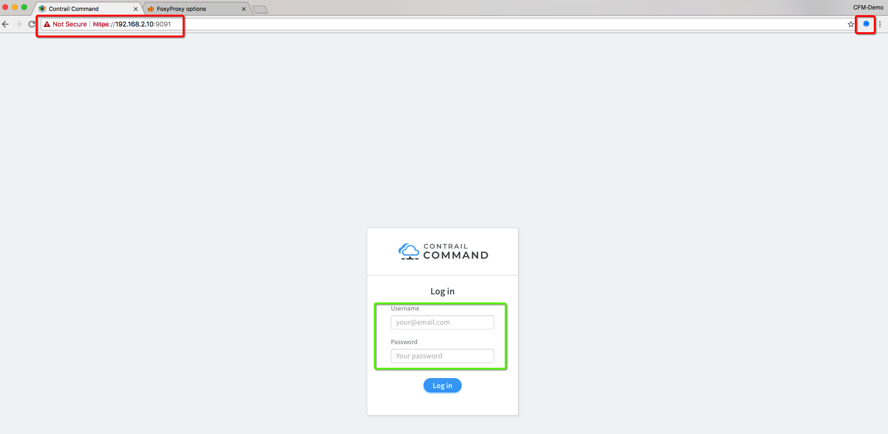

#  Installation of Contrail Command


The 1st step after bringing up the topology is the Installation of Contrail Command and for that Contrail Command will be installed on s-srv1. Please follow following steps for installtion and accessing the GUI after the installation.


Note: Contrail Command can be isnatlled on your PC/Laptop or any other machine as well but in our setup we have alocated s-srv1 for Contrail Command

```bash
# Let's 1st install git and ansible SW
cd /root/cfm-vagrant/cfm-1x1-vqfx-7srv

# Check status of all servers and vQFXs using following command
vagrant status

vagrant ssh s-srv1
sudo su
cd /opt
yum -y install git ansible-2.4.2.0

# Git Clone Contrail Command Deployer repo
git clone https://github.com/Juniper/contrail-command-deployer.git

cd contrail-command-deployer
vi config/command_servers.yml

# Add IP address of s-srv1 "192.168.2.10" and TAG for the Contrail Command Container, for our testing we used 5.0-154


# Start Contrail Command Deployment 
ansible-playbook playbooks/deploy.yml
 ```

## Contrail Command 5.0.1 GA Procedure

For Contrail Command GA please follow following steps:

* Install Docker

```bash
yum install -y yum-utils device-mapper-persistent-data lvm2
yum-config-manager --add-repo https://download.docker.com/linux/centos/docker-ce.repo
yum install -y docker-ce
systemctl start docker
 ```

* Setup insecure registry for internal docker registry. This step is not required for "hub.juniper.net"

```bash
vi /etc/docker/daemon.json

# Add following line to the file
{"insecure-registries": ["ci-repo.englab.juniper.net:5010"]}

# Svae changes & restart docker
systemctl restart docker

 ```

* Download reference "comman_servers.tml" and update the config as per your environment.

```bash
cd /opt
wget https://raw.githubusercontent.com/qarham/cfm-vagrant/master/docs/scripts/command_servers.yml

# Now please make changes in config file
vi command_servers.yml
 ```


* Internal Repo

```bash
# Use following command for internal registry
docker pull ci-repo.englab.juniper.net:5010/contrail-command-deployer:5.0-214

docker run -t --net host -v /opt/command_servers.yml:/command_servers.yml -d --privileged --name contrail_command_deployer ci-repo.englab.juniper.net:5010/contrail-command-deployer:5.0-214
 ```

* External Repo "hub.juniper.net"

```bash
# For external use following steps
docker login hub.juniper.net/contrail
# Provide username/password
# Once login pull Contrail Command image using
docker pull hub.juniper.net/contrail/contrail-command-deployer:5.0.1-0.214

# AFter that please use following command to bring contrail command up.  
docker run -t --net host -v /opt/command_servers.yml:/command_servers.yml -d --privileged --name contrail_command_deployer hub.juniper.net/contrail/contrail-command-deployer:5.0.1-0.214
 ```

***Note*** Reference [Contrail Comman Servers File](https://raw.githubusercontent.com/qarham/cfm-vagrant/master/docs/scripts/command_servers.yml)

 Now to check the progress of installation use "docker log" command

 ```bash
docker logs -f contrail_command_deployer
 ```

***Here is recorded screen session for Contrail Command Installation***

[](https://asciinema.org/a/vh7WqrGOSbVoHxI4YCd1ohGS2)

## Contrail Command GUI Access via FoxyProxy

Please use following links for FoxyProxy Setup and configuration. 

* ### [FoxyProxy Setup for Chrome](FoxyProxy-Chrome-Setup.md)

* ### [FoxyProxy Setup for FireFox](FoxyProxy-FireFox-Setup.md)


```bash
# 1st step is open SSH session to the host node 
ssh root@10.87.65.30 -D 1080
 ```

* https://192.168.2.10:9091
    * Username/Password: admin/contrail123




## How to add pre-provisioned Contrail Cluster in Contrail Command?

In case OpenStack/Contrail Cluster is up and running and would like adding existing cluster into Contrail Command, please copy "instances.yml" file under "/opt" and also download "command_servers.yml" file, update "command_servers.yml" as per your host config and run following command.

```bash
docker run -t --net host -e orchestrator=openstack -e action=import_cluster -v /opt/command_servers.yml:/command_servers.yml -v /opt/instances.yml:/instances.yml -d --privileged --name contrail_command_deployer hub.juniper.net/contrail/contrail-command-deployer:5.0.1-0.214
 ```


### References

* <https://github.com/Juniper/contrail-ansible-deployer/wiki>
* <https://github.com/Juniper/vqfx10k-vagrant>
* <https://www.juniper.net/documentation/en_US/contrail5.0/topics/task/configuration/import-cluster-data-contrail-command.html>