# Creation of Fabric via Contrail Command UI


## 1. Create Fabric

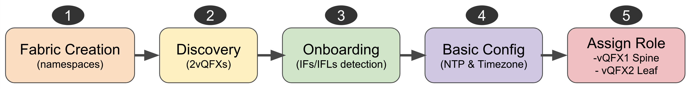

In our case vQFXs are already created via Vagrant so please use "Existing ".

Login to Contrail Command via FoxyProxy and click "Fabric" --> "Create Fabric"

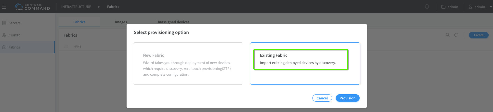

Create Fabric Name, add following namespaces and credentials:

* Name: Fabric01
* Fabric Namespace:
  * Fabric ASN: 64512
  * Fabric MGMT IP addresses: 172.16.1.1/32 & 172.16.2.1/32
  * Credentials: root/c0ntrail123

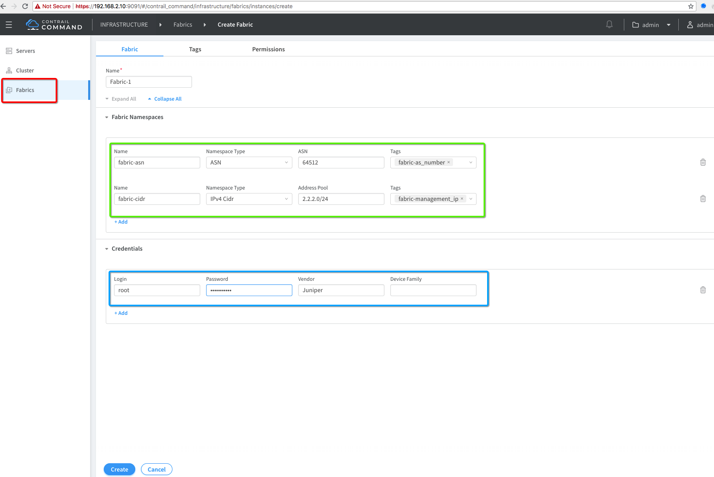


## 2. Fabric Discovery

Please follow below screenshots to start fabric discovery and check ansible playbooks logs.

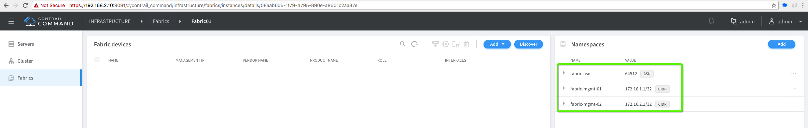

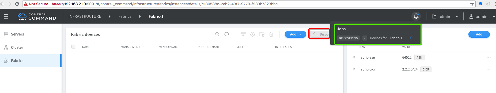

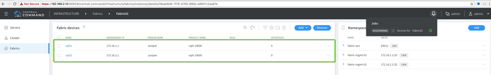

Check following logs during discovery

```bash
cd cfm-vagrant/cfm-1x1-vqfx-7srv
vagrant status

vagrant ssh s-srv2

tail -200f /var/log/contrail/contrail-fabric-ansible-playbooks.log

tail -200f /var/log/contrail/contrail-fabric-ansible.log
 ```

## 3. Fabric Onboarding

Please follow below screenshots to start fabric onboarding and check ansible playbooks logs.

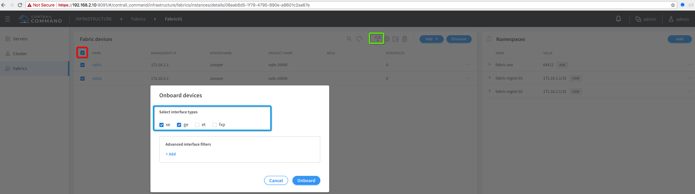

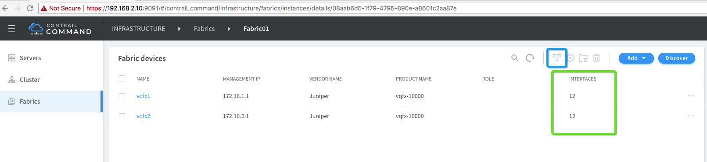

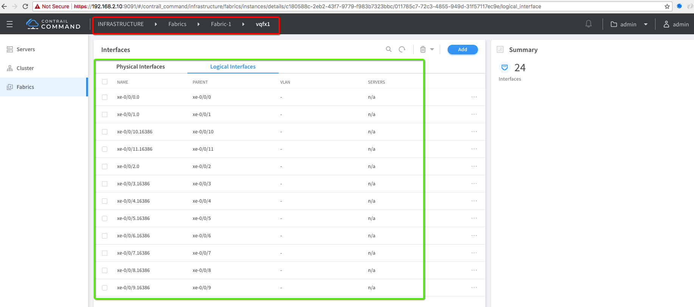

Check following logs during discovery

```bash
cd cfm-vagrant/cfm-1x1-vqfx-7srv
vagrant status

vagrant ssh s-srv2

tail -200f /var/log/contrail/contrail-fabric-ansible-playbooks.log

tail -200f /var/log/contrail/contrail-fabric-ansible.log
 ```

## 4. Basic Fabric Configuration (BGP Routers Add)

This is the last mandatory step which will add BGP Routers on Contrail Controller end and also configrue the vQFXs with BGP configuration.

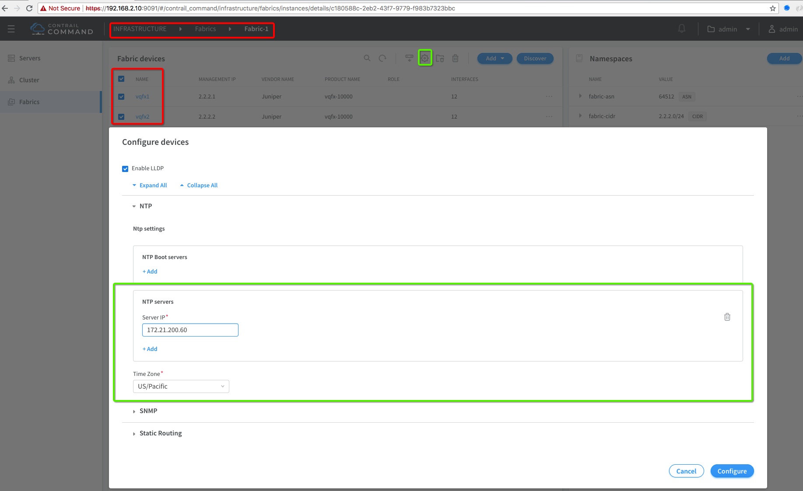

Once Fabric Configuration is completed you can check new BGP Routers under Cluster-----> advance options

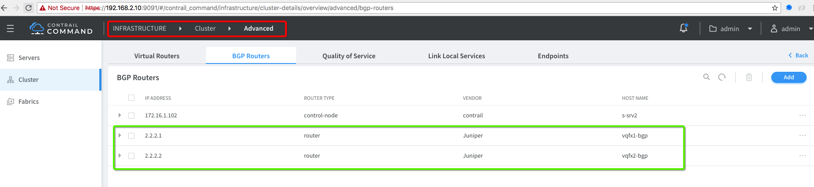

Along with NTP server IP and TimeZone configuration addition to the each vQFX box following configs are also added.

```bash
set system time-zone US/Pacific
set system ntp server 172.21.200.60
 ```

***vQFX1 Config Changes***
```bash
vagrant@vqfx1> show configuration groups | display set    
set groups __contrail__ interfaces lo0 unit 0 family inet address 2.2.2.1/32 primary
set groups __contrail__ interfaces lo0 unit 0 family inet address 2.2.2.1/32 preferred
set groups __contrail__ routing-options router-id 2.2.2.1
set groups __contrail__ routing-options route-distinguisher-id 2.2.2.1
set groups __contrail__ routing-options autonomous-system 64512
set groups __contrail__ routing-options resolution rib bgp.rtarget.0 resolution-ribs inet.0
set groups __contrail__ protocols bgp group _contrail_asn-64512 type internal
set groups __contrail__ protocols bgp group _contrail_asn-64512 local-address 2.2.2.1
set groups __contrail__ protocols bgp group _contrail_asn-64512 hold-time 90
set groups __contrail__ protocols bgp group _contrail_asn-64512 family evpn signaling
set groups __contrail__ protocols bgp group _contrail_asn-64512 family route-target
set groups __contrail__ protocols bgp group _contrail_asn-64512 neighbor 172.16.1.102 peer-as 64512
set groups __contrail__ protocols bgp group _contrail_asn-64512 neighbor 2.2.2.2 peer-as 64512
set groups __contrail__ policy-options community _contrail_switch_policy_ members target:64512:1
set groups __contrail__ switch-options vtep-source-interface lo0.0

{master:0}
vagrant@vqfx1> show bgp summary 
Groups: 2 Peers: 3 Down peers: 0
Table          Tot Paths  Act Paths Suppressed    History Damp State    Pending
bgp.rtarget.0        
                       7          7          0          0          0          0
inet.0               
                       2          2          0          0          0          0
bgp.evpn.0           
                       0          0          0          0          0          0
Peer                     AS      InPkt     OutPkt    OutQ   Flaps Last Up/Dwn State|#Active/Received/Accepted/Damped...
2.2.2.2               64512         16         15       0       0        5:55 Establ
  bgp.rtarget.0: 0/0/0/0
  bgp.evpn.0: 0/0/0/0
10.0.0.2              64501        955        954       0       0     7:07:09 Establ
  inet.0: 2/2/2/0
172.16.1.102          64512         17         17       0       0        6:46 Establ
  bgp.rtarget.0: 7/7/7/0
  bgp.evpn.0: 0/0/0/0
 ```

***vQFX2 Config Changes***
```bash
vagrant@vqfx2> show configuration groups | display set 
set groups __contrail__ interfaces lo0 unit 0 family inet address 2.2.2.2/32 primary
set groups __contrail__ interfaces lo0 unit 0 family inet address 2.2.2.2/32 preferred
set groups __contrail__ routing-options router-id 2.2.2.2
set groups __contrail__ routing-options route-distinguisher-id 2.2.2.2
set groups __contrail__ routing-options autonomous-system 64512
set groups __contrail__ routing-options resolution rib bgp.rtarget.0 resolution-ribs inet.0
set groups __contrail__ protocols bgp group _contrail_asn-64512 type internal
set groups __contrail__ protocols bgp group _contrail_asn-64512 local-address 2.2.2.2
set groups __contrail__ protocols bgp group _contrail_asn-64512 hold-time 90
set groups __contrail__ protocols bgp group _contrail_asn-64512 family evpn signaling
set groups __contrail__ protocols bgp group _contrail_asn-64512 family route-target
set groups __contrail__ protocols bgp group _contrail_asn-64512 neighbor 172.16.1.102 peer-as 64512
set groups __contrail__ protocols bgp group _contrail_asn-64512 neighbor 2.2.2.1 peer-as 64512
set groups __contrail__ policy-options community _contrail_switch_policy_ members target:64512:1
set groups __contrail__ switch-options vtep-source-interface lo0.0

{master:0}
vagrant@vqfx2> show bgp summary 
Groups: 2 Peers: 3 Down peers: 0
Table          Tot Paths  Act Paths Suppressed    History Damp State    Pending
bgp.rtarget.0        
                       7          7          0          0          0          0
inet.0               
                       2          2          0          0          0          0
bgp.evpn.0           
                       0          0          0          0          0          0
Peer                     AS      InPkt     OutPkt    OutQ   Flaps Last Up/Dwn State|#Active/Received/Accepted/Damped...
2.2.2.1               64512         27         26       0       0       10:50 Establ
  bgp.rtarget.0: 0/0/0/0
  bgp.evpn.0: 0/0/0/0
10.0.0.1              64601        966        965       0       0     7:12:05 Establ
  inet.0: 2/2/2/0
172.16.1.102          64512         25         25       0       0       10:49 Establ
  bgp.rtarget.0: 7/7/7/0
  bgp.evpn.0: 0/0/0/0
 ```

Check following logs during Fabric Configure process.

```bash
cd cfm-vagrant/cfm-1x1-vqfx-7srv
vagrant status

vagrant ssh s-srv2

tail -200f /var/log/contrail/contrail-fabric-ansible-playbooks.log

tail -200f /var/log/contrail/contrail-fabric-ansible.log
 ```

## 5. Fabric vQFX Role Assignment

***vQFX1 as Spine***
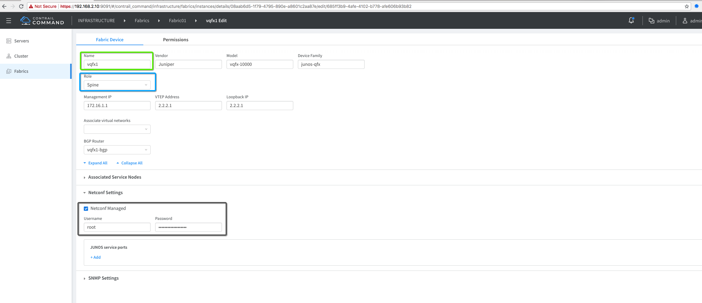

```bash
set groups __contrail__ protocols bgp group _contrail_asn-64512 export _contrail_ibgp_export_policy

set groups __contrail__ policy-options policy-statement _contrail_ibgp_export_policy term inet-vpn from family inet-vpn
set groups __contrail__ policy-options policy-statement _contrail_ibgp_export_policy term inet-vpn then next-hop self
set groups __contrail__ policy-options policy-statement _contrail_ibgp_export_policy term inet6-vpn from family inet6-vpn
set groups __contrail__ policy-options policy-statement _contrail_ibgp_export_policy term inet6-vpn then next-hop self

 ```

***vQFX2 as Leaf***
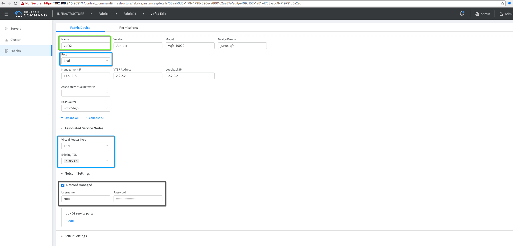

Note: No config change on vQFX1 (leaf)


## 6. Verify BGP Control Plane

Now let's verify after configuring vQFX in spine & leaf role with basic config BGP session is up with Contrail Controller using following commands.

```bash
show bgp summary

show route receive-protocol bgp 172.16.1.102

On the browser (Contrail introspect):

http://192.168.2.11:8083/Snh_ShowBgpNeighborSummaryReq?search_string=

 ```

### References

* <https://github.com/Juniper/contrail-ansible-deployer/wiki>
* https://github.com/Juniper/contrail-command-deployer/wiki/Using-Ansible-to-launch-the-Contrail-Command-Containers
* <https://github.com/Juniper/vqfx10k-vagrant>