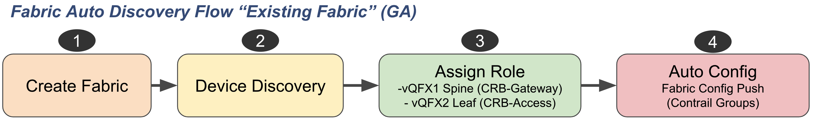
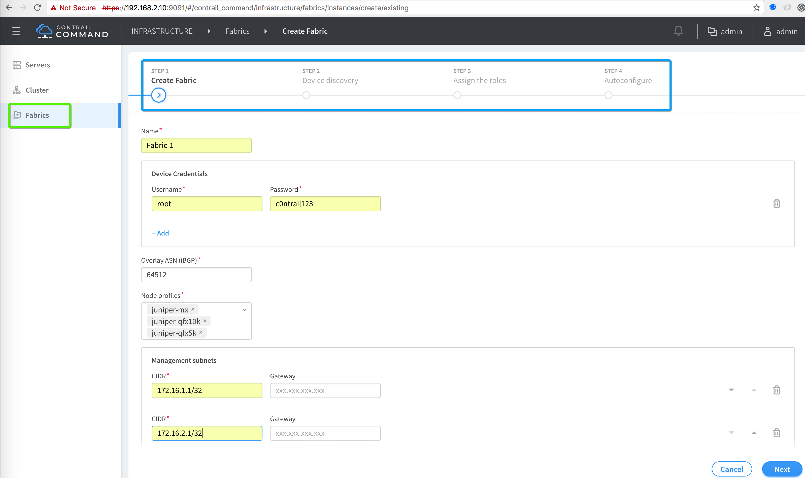
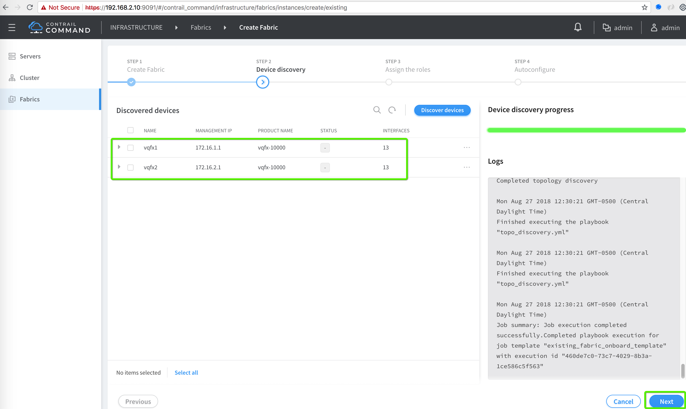
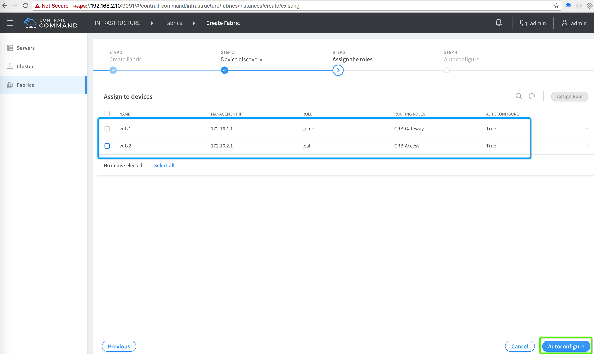
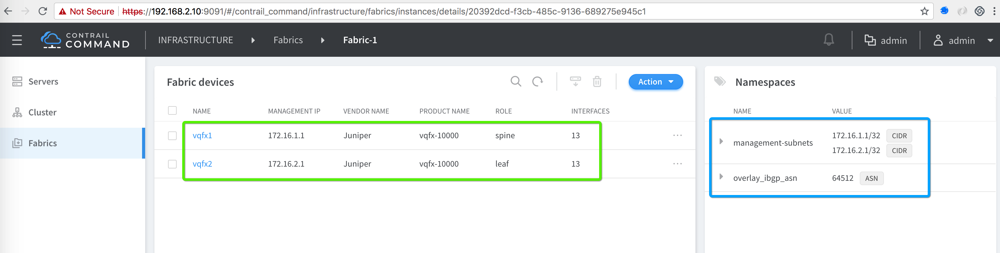
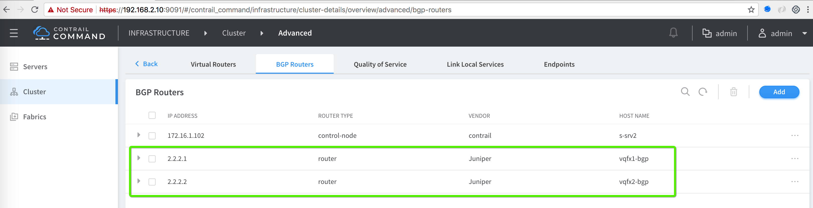
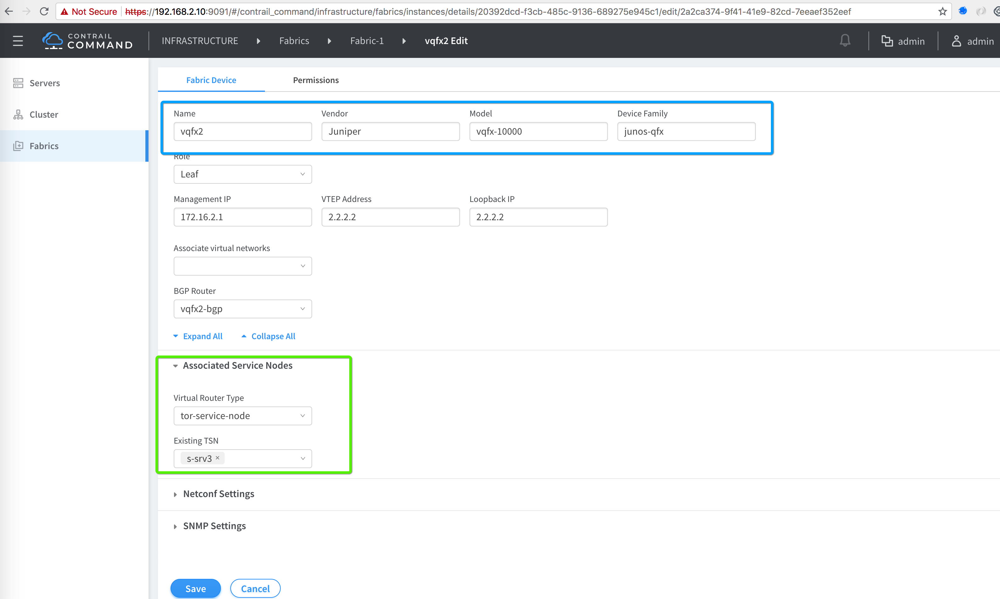

# Creation of Fabric via Contrail Command UI


## 1. Fabric Creation, Discovery and Auto-config

In Conttrail 5.0.1 GA the whole fabric creation and discovery process is handled via a wizard. Here is the flow.



In our case vQFXs are already created via Vagrant so please use "Existing ".

Login to Contrail Command via FoxyProxy and click "Fabric" --> "Create Fabric"


Create Fabric Name, add following namespaces and credentials:

* Name: Fabric-1
* Fabric Namespace:
  * Fabric ASN: 64512
  * Fabric MGMT IP addresses: 172.16.1.1/32 & 172.16.2.1/32
  * Credentials: root/c0ntrail123



* Device discovery completed



* Fabric devices roles assignment



* Fabric creation completed



* Check BGP Peer is established between Contrail Conttroller and Fabric Nodes (Spine/Leaf).
  


* Assign CSN to vQFX1 (Leaf) node.



Check following logs during discovery

```bash
cd cfm-vagrant/cfm-1x1-vqfx-7srv
vagrant status

vagrant ssh s-srv2

tail -200f /var/log/contrail/contrail-fabric-ansible-playbooks.log

tail -200f /var/log/contrail/contrail-fabric-ansible.log
 ```

## 2. Fabric Side Config Changes

***vQFX1 Config Changes***
```bash
vagrant@vqfx1> show configuration groups ?  
Possible completions:
  <[Enter]>            Execute this command
  <group_name>         Group name
  __contrail_basic__   Group name
  __contrail_ip_clos__  Group name
  __contrail_overlay_bgp__  Group name
  __contrail_overlay_evpn__  Group name
  __contrail_overlay_evpn_type5__  Group name
  __contrail_overlay_lag__  Group name
  __contrail_overlay_multi_homing__  Group name
  __contrail_overlay_security_group__  Group name
  |                    Pipe through a command

vagrant@vqfx1> show configuration groups | display set    
set groups __contrail_basic__ snmp community public authorization read-only
set groups __contrail_ip_clos__ routing-options router-id 2.2.2.1
set groups __contrail_ip_clos__ routing-options route-distinguisher-id 2.2.2.1
set groups __contrail_ip_clos__ routing-options autonomous-system 64512
set groups __contrail_ip_clos__ routing-options forwarding-table export PFE-LB
set groups __contrail_ip_clos__ routing-options forwarding-table ecmp-fast-reroute
set groups __contrail_ip_clos__ policy-options policy-statement PFE-LB then load-balance per-packet
set groups __contrail_ip_clos__ policy-options policy-statement IPCLOS_BGP_EXP term loopback from protocol direct
set groups __contrail_ip_clos__ policy-options policy-statement IPCLOS_BGP_EXP term loopback from interface lo0.0
set groups __contrail_ip_clos__ policy-options policy-statement IPCLOS_BGP_EXP term loopback then accept
set groups __contrail_ip_clos__ policy-options policy-statement IPCLOS_BGP_EXP term default then reject
set groups __contrail_ip_clos__ policy-options policy-statement IPCLOS_BGP_IMP term loopback from protocol bgp
set groups __contrail_ip_clos__ policy-options policy-statement IPCLOS_BGP_IMP term loopback from protocol direct
set groups __contrail_ip_clos__ policy-options policy-statement IPCLOS_BGP_IMP term loopback then accept
set groups __contrail_ip_clos__ policy-options policy-statement IPCLOS_BGP_IMP term default then reject
set groups __contrail_overlay_bgp__ routing-options resolution rib bgp.rtarget.0 resolution-ribs inet.0
set groups __contrail_overlay_bgp__ protocols bgp group _contrail_asn-64512 type internal
set groups __contrail_overlay_bgp__ protocols bgp group _contrail_asn-64512 local-address 2.2.2.1
set groups __contrail_overlay_bgp__ protocols bgp group _contrail_asn-64512 hold-time 90
set groups __contrail_overlay_bgp__ protocols bgp group _contrail_asn-64512 family evpn signaling
set groups __contrail_overlay_bgp__ protocols bgp group _contrail_asn-64512 family route-target
set groups __contrail_overlay_bgp__ protocols bgp group _contrail_asn-64512 export _contrail_ibgp_export_policy
set groups __contrail_overlay_bgp__ protocols bgp group _contrail_asn-64512 multipath
set groups __contrail_overlay_bgp__ protocols bgp group _contrail_asn-64512 neighbor 172.16.1.102 peer-as 64512
set groups __contrail_overlay_bgp__ protocols bgp group _contrail_asn-64512 neighbor 2.2.2.2 peer-as 64512
set groups __contrail_overlay_bgp__ policy-options policy-statement _contrail_ibgp_export_policy term inet-vpn then next-hop self
set groups __contrail_overlay_bgp__ policy-options policy-statement _contrail_ibgp_export_policy term inet6-vpn then next-hop self
set groups __contrail_overlay_evpn__ protocols evpn encapsulation vxlan
set groups __contrail_overlay_evpn__ protocols evpn multicast-mode ingress-replication
set groups __contrail_overlay_evpn__ protocols evpn extended-vni-list all
set groups __contrail_overlay_evpn__ switch-options vtep-source-interface lo0.0
set groups __contrail_overlay_evpn__ switch-options route-distinguisher 2.2.2.1:1
set groups __contrail_overlay_evpn__ switch-options vrf-target target:64512:1
set groups __contrail_overlay_evpn__ switch-options vrf-target auto
set groups __contrail_overlay_evpn_type5__
set groups __contrail_overlay_lag__
set groups __contrail_overlay_multi_homing__
set groups __contrail_overlay_security_group__

vagrant@vqfx1> show bgp summary                           
Groups: 2 Peers: 3 Down peers: 0
Table          Tot Paths  Act Paths Suppressed    History Damp State    Pending
bgp.rtarget.0        
                       8          7          0          0          0          0
inet.0               
                       2          2          0          0          0          0
bgp.evpn.0           
                       0          0          0          0          0          0
Peer                     AS      InPkt     OutPkt    OutQ   Flaps Last Up/Dwn State|#Active/Received/Accepted/Damped...
2.2.2.2               64512        165        163       0       0     1:13:20 Establ
  bgp.rtarget.0: 0/1/1/0
  bgp.evpn.0: 0/0/0/0
  default-switch.evpn.0: 0/0/0/0
  __default_evpn__.evpn.0: 0/0/0/0
10.0.0.2              64501       3328       3326       0       0  1d 0:53:33 Establ
  inet.0: 2/2/2/0
172.16.1.102          64512        150        164       0       0     1:13:22 Establ
  bgp.rtarget.0: 7/7/7/0
  bgp.evpn.0: 0/0/0/0
  default-switch.evpn.0: 0/0/0/0
  __default_evpn__.evpn.0: 0/0/0/0

{master:0}
 ```

***vQFX2 Config Changes***
```bash
vagrant@vqfx2> show configuration groups ?  
Possible completions:
  <[Enter]>            Execute this command
  <group_name>         Group name
  __contrail_basic__   Group name
  __contrail_ip_clos__  Group name
  __contrail_overlay_bgp__  Group name
  __contrail_overlay_evpn__  Group name
  __contrail_overlay_lag__  Group name
  __contrail_overlay_multi_homing__  Group name
  __contrail_overlay_security_group__  Group name
  |                    Pipe through a command
{master:0}

vagrant@vqfx2> show configuration groups | display set 
set groups __contrail_basic__ snmp community public authorization read-only
set groups __contrail_ip_clos__ routing-options router-id 2.2.2.2
set groups __contrail_ip_clos__ routing-options route-distinguisher-id 2.2.2.2
set groups __contrail_ip_clos__ routing-options autonomous-system 64512
set groups __contrail_ip_clos__ routing-options forwarding-table export PFE-LB
set groups __contrail_ip_clos__ routing-options forwarding-table ecmp-fast-reroute
set groups __contrail_ip_clos__ policy-options policy-statement PFE-LB then load-balance per-packet
set groups __contrail_ip_clos__ policy-options policy-statement IPCLOS_BGP_EXP term loopback from protocol direct
set groups __contrail_ip_clos__ policy-options policy-statement IPCLOS_BGP_EXP term loopback from interface lo0.0
set groups __contrail_ip_clos__ policy-options policy-statement IPCLOS_BGP_EXP term loopback then accept
set groups __contrail_ip_clos__ policy-options policy-statement IPCLOS_BGP_EXP term default then reject
set groups __contrail_ip_clos__ policy-options policy-statement IPCLOS_BGP_IMP term loopback from protocol bgp
set groups __contrail_ip_clos__ policy-options policy-statement IPCLOS_BGP_IMP term loopback from protocol direct
set groups __contrail_ip_clos__ policy-options policy-statement IPCLOS_BGP_IMP term loopback then accept
set groups __contrail_ip_clos__ policy-options policy-statement IPCLOS_BGP_IMP term default then reject
set groups __contrail_overlay_bgp__ routing-options resolution rib bgp.rtarget.0 resolution-ribs inet.0
set groups __contrail_overlay_bgp__ protocols bgp group _contrail_asn-64512 type internal
set groups __contrail_overlay_bgp__ protocols bgp group _contrail_asn-64512 local-address 2.2.2.2
set groups __contrail_overlay_bgp__ protocols bgp group _contrail_asn-64512 hold-time 90
set groups __contrail_overlay_bgp__ protocols bgp group _contrail_asn-64512 family evpn signaling
set groups __contrail_overlay_bgp__ protocols bgp group _contrail_asn-64512 family route-target
set groups __contrail_overlay_bgp__ protocols bgp group _contrail_asn-64512 export _contrail_ibgp_export_policy
set groups __contrail_overlay_bgp__ protocols bgp group _contrail_asn-64512 multipath
set groups __contrail_overlay_bgp__ protocols bgp group _contrail_asn-64512 neighbor 172.16.1.102 peer-as 64512
set groups __contrail_overlay_bgp__ protocols bgp group _contrail_asn-64512 neighbor 2.2.2.1 peer-as 64512
set groups __contrail_overlay_bgp__ policy-options policy-statement _contrail_ibgp_export_policy term inet-vpn then next-hop self
set groups __contrail_overlay_bgp__ policy-options policy-statement _contrail_ibgp_export_policy term inet6-vpn then next-hop self
set groups __contrail_overlay_evpn__ protocols evpn encapsulation vxlan
set groups __contrail_overlay_evpn__ protocols evpn multicast-mode ingress-replication
set groups __contrail_overlay_evpn__ protocols evpn extended-vni-list all
set groups __contrail_overlay_evpn__ switch-options vtep-source-interface lo0.0
set groups __contrail_overlay_evpn__ switch-options route-distinguisher 2.2.2.2:1
set groups __contrail_overlay_evpn__ switch-options vrf-target target:64512:1
set groups __contrail_overlay_evpn__ switch-options vrf-target auto
set groups __contrail_overlay_lag__
set groups __contrail_overlay_multi_homing__
set groups __contrail_overlay_security_group__

vagrant@vqfx2> show bgp summary                           
Groups: 2 Peers: 3 Down peers: 0
Table          Tot Paths  Act Paths Suppressed    History Damp State    Pending
bgp.rtarget.0        
                       8          7          0          0          0          0
inet.0               
                       2          2          0          0          0          0
bgp.evpn.0           
                       0          0          0          0          0          0
Peer                     AS      InPkt     OutPkt    OutQ   Flaps Last Up/Dwn State|#Active/Received/Accepted/Damped...
2.2.2.1               64512        169        169       0       0     1:15:29 Establ
  bgp.rtarget.0: 0/1/1/0
  bgp.evpn.0: 0/0/0/0
  default-switch.evpn.0: 0/0/0/0
  __default_evpn__.evpn.0: 0/0/0/0
10.0.0.1              64601       3333       3333       0       0  1d 0:55:47 Establ
  inet.0: 2/2/2/0
172.16.1.102          64512        155        170       0       0     1:15:33 Establ
  bgp.rtarget.0: 7/7/7/0
  bgp.evpn.0: 0/0/0/0
  default-switch.evpn.0: 0/0/0/0
  __default_evpn__.evpn.0: 0/0/0/0

{master:0}

 ```

## 3. Verify BGP Control Plane

Now let's verify after configuring vQFX in spine & leaf role with basic config BGP session is up with Contrail Controller using following commands.

```bash
show bgp summary

show route receive-protocol bgp 172.16.1.102

On the browser (Contrail introspect):

http://192.168.2.11:8083/Snh_ShowBgpNeighborSummaryReq?search_string=

 ```

## Contrail Command Brownfield Fabric Discovery video recorded Session (Click the icon)

[](https://www.useloom.com/share/74e96d152a714d33afa7e5fdd48c1869 "Contrail Command Provisioning")


### References

* <https://github.com/Juniper/contrail-ansible-deployer/wiki>
* https://github.com/Juniper/contrail-command-deployer/wiki/Using-Ansible-to-launch-the-Contrail-Command-Containers
* <https://github.com/Juniper/vqfx10k-vagrant>