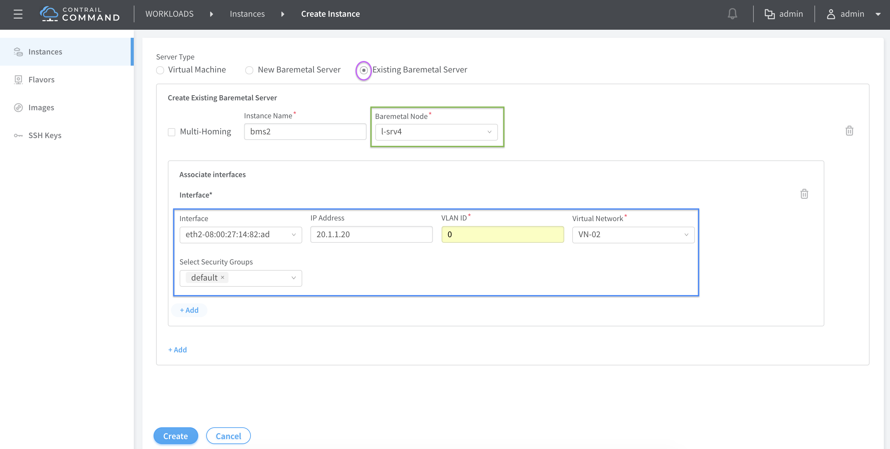

# BMS to VM Inter VN

At this point we are going to extend our BMS-VM fabric by creating a non-LCM BMS instance in VN-02 and enabling L3 connectivity between VMs and BMS servers running in VN-01 and VN-02 using EVPN Type-5 VRFs anchored on the Spine vQFX (CRB).


## 1. Add Non-LCM BMS node - l-srv4

Navigate to INFRASTRUCTURE > Servers on the Contrail Command UI and click on Add button on the left top corner to add the second BMS server l-srv4. l-srv4
eth2 interface MAC should be provided under Network Interfaces MAC address and specify "Leaf Device/TOR - Interface" as vqfx2-xe-0/0/4.


```bash
To get the MAC address of l-srv4 simply run the command "vagrant ssh -c 'cat /sys/class/net/eth2/address' l-srv4" from the vagrant directory. Other way
is to ssh to the l-srv4 VM
```

## 2. Create the 2nd BMS instance.

For bms2 we assume that the BMS is a existing BMS migrated from legacy network to VN-02 and has a pre-existing ip address of 20.1.1.20. And we are going to retain 
that IP address. On l-srv4 flush the 172 ip address on eth2 and statically configure 20.1.1.20 as the IP address.



## Configs pushed to the leaf vqfx.

```bash
set groups __contrail__ interfaces lo0 unit 0 family inet address 2.2.2.2/32 primary
set groups __contrail__ interfaces lo0 unit 0 family inet address 2.2.2.2/32 preferred
set groups __contrail__ interfaces xe-0/0/3 flexible-vlan-tagging
set groups __contrail__ interfaces xe-0/0/3 native-vlan-id 4094
set groups __contrail__ interfaces xe-0/0/3 encapsulation extended-vlan-bridge
set groups __contrail__ interfaces xe-0/0/3 unit 0 vlan-id 4094
set groups __contrail__ interfaces xe-0/0/4 flexible-vlan-tagging
set groups __contrail__ interfaces xe-0/0/4 native-vlan-id 4094
set groups __contrail__ interfaces xe-0/0/4 encapsulation extended-vlan-bridge
set groups __contrail__ interfaces xe-0/0/4 unit 0 vlan-id 4094
set groups __contrail__ routing-options router-id 2.2.2.2
set groups __contrail__ routing-options route-distinguisher-id 2.2.2.2
set groups __contrail__ routing-options autonomous-system 64512
set groups __contrail__ routing-options resolution rib bgp.rtarget.0 resolution-ribs inet.0
set groups __contrail__ protocols bgp group _contrail_asn-64512 type internal
set groups __contrail__ protocols bgp group _contrail_asn-64512 local-address 2.2.2.2
set groups __contrail__ protocols bgp group _contrail_asn-64512 hold-time 90
set groups __contrail__ protocols bgp group _contrail_asn-64512 family evpn signaling
set groups __contrail__ protocols bgp group _contrail_asn-64512 family route-target
set groups __contrail__ protocols bgp group _contrail_asn-64512 neighbor 172.16.1.102 peer-as 64512
set groups __contrail__ protocols bgp group _contrail_asn-64512 neighbor 2.2.2.1 peer-as 64512
set groups __contrail__ protocols evpn vni-options vni 5 vrf-target target:64512:8000003
set groups __contrail__ protocols evpn vni-options vni 6 vrf-target target:64512:8000004
set groups __contrail__ protocols evpn encapsulation vxlan
set groups __contrail__ protocols evpn multicast-mode ingress-replication
set groups __contrail__ protocols evpn extended-vni-list all
set groups __contrail__ policy-options policy-statement _contrail_VN-01-l2-5-import term _contrail_switch_policy_ from community _contrail_switch_policy_
set groups __contrail__ policy-options policy-statement _contrail_VN-01-l2-5-import term _contrail_switch_policy_ then accept
set groups __contrail__ policy-options policy-statement _contrail_VN-01-l2-5-import term t1 from community _contrail_target_64512_8000003
set groups __contrail__ policy-options policy-statement _contrail_VN-01-l2-5-import term t1 then accept
set groups __contrail__ policy-options policy-statement _contrail_VN-02-l2-6-import term _contrail_switch_policy_ from community _contrail_switch_policy_
set groups __contrail__ policy-options policy-statement _contrail_VN-02-l2-6-import term _contrail_switch_policy_ then accept
set groups __contrail__ policy-options policy-statement _contrail_VN-02-l2-6-import term t1 from community _contrail_target_64512_8000004
set groups __contrail__ policy-options policy-statement _contrail_VN-02-l2-6-import term t1 then accept
set groups __contrail__ policy-options policy-statement _contrail_switch_export_policy_ term t1 then community add _contrail_switch_export_community_
set groups __contrail__ policy-options community _contrail_target_64512_8000004 members target:64512:8000004
set groups __contrail__ policy-options community _contrail_target_64512_8000003 members target:64512:8000003
set groups __contrail__ policy-options community _contrail_switch_export_community_ members target:64512:8000004
set groups __contrail__ policy-options community _contrail_switch_export_community_ members target:64512:8000003
set groups __contrail__ policy-options community _contrail_switch_policy_ members target:64512:1
set groups __contrail__ switch-options vtep-source-interface lo0.0
set groups __contrail__ switch-options route-distinguisher 2.2.2.2:1
set groups __contrail__ switch-options vrf-import _contrail_VN-01-l2-5-import
set groups __contrail__ switch-options vrf-import _contrail_VN-02-l2-6-import
set groups __contrail__ switch-options vrf-export _contrail_switch_export_policy_
set groups __contrail__ switch-options vrf-target target:64512:1
set groups __contrail__ switch-options vrf-target auto
set groups __contrail__ vlans contrail_VN-01-l2-5 interface xe-0/0/3.0
set groups __contrail__ vlans contrail_VN-01-l2-5 vxlan vni 5
set groups __contrail__ vlans contrail_VN-02-l2-6 interface xe-0/0/4.0
set groups __contrail__ vlans contrail_VN-02-l2-6 vxlan vni 6
```

## 3. BMS2 connectivity to VMs in VN-02.

```bash
[root@l-srv4 ~]# ip addr flush dev eth2
[root@l-srv4 ~]# ip route delete default
[root@l-srv4 ~]# ip addr add dev eth2 20.1.1.20/24
[root@l-srv4 ~]# ip route add default via 20.1.1.1
[root@l-srv4 ~]# ip addr
1: lo: <LOOPBACK,UP,LOWER_UP> mtu 65536 qdisc noqueue state UNKNOWN group default qlen 1000
    link/loopback 00:00:00:00:00:00 brd 00:00:00:00:00:00
    inet 127.0.0.1/8 scope host lo
       valid_lft forever preferred_lft forever
    inet6 ::1/128 scope host
       valid_lft forever preferred_lft forever
2: eth0: <BROADCAST,MULTICAST,UP,LOWER_UP> mtu 1500 qdisc pfifo_fast state UP group default qlen 1000
    link/ether 08:00:27:fc:20:25 brd ff:ff:ff:ff:ff:ff
    inet 10.0.2.15/24 brd 10.0.2.255 scope global noprefixroute dynamic eth0
       valid_lft 81561sec preferred_lft 81561sec
3: eth1: <BROADCAST,MULTICAST,UP,LOWER_UP> mtu 1500 qdisc pfifo_fast state UP group default qlen 1000
    link/ether 08:00:27:ff:c9:d0 brd ff:ff:ff:ff:ff:ff
    inet 192.168.2.16/25 brd 192.168.2.127 scope global noprefixroute eth1
       valid_lft forever preferred_lft forever
    inet6 fe80::a00:27ff:feff:c9d0/64 scope link
       valid_lft forever preferred_lft forever
4: eth2: <BROADCAST,MULTICAST,UP,LOWER_UP> mtu 1500 qdisc pfifo_fast state UP group default qlen 1000
    link/ether 08:00:27:14:82:ad brd ff:ff:ff:ff:ff:ff
    inet 20.1.1.20/24 scope global eth2
       valid_lft forever preferred_lft forever
[root@l-srv4 ~]# ip route
default via 20.1.1.1 dev eth2
10.0.2.0/24 dev eth0 proto kernel scope link src 10.0.2.15 metric 100
20.1.1.0/24 dev eth2 proto kernel scope link src 20.1.1.20
20.1.1.0/24 dev eth2 proto kernel scope link src 20.1.1.20 metric 102
192.168.2.0/25 dev eth1 proto kernel scope link src 192.168.2.16 metric 101
[root@l-srv4 ~]#
[root@l-srv4 ~]# ping -c 5 20.1.1.3
PING 20.1.1.3 (20.1.1.3) 56(84) bytes of data.
64 bytes from 20.1.1.3: icmp_seq=1 ttl=64 time=340 ms
64 bytes from 20.1.1.3: icmp_seq=2 ttl=64 time=136 ms
64 bytes from 20.1.1.3: icmp_seq=3 ttl=64 time=141 ms
64 bytes from 20.1.1.3: icmp_seq=4 ttl=64 time=35.6 ms
64 bytes from 20.1.1.3: icmp_seq=5 ttl=64 time=141 ms

--- 20.1.1.3 ping statistics ---
5 packets transmitted, 5 received, 0% packet loss, time 4013ms
rtt min/avg/max/mdev = 35.664/159.051/340.657/99.346 ms
[root@l-srv4 ~]# ping -c 5 20.1.1.4
PING 20.1.1.4 (20.1.1.4) 56(84) bytes of data.
64 bytes from 20.1.1.4: icmp_seq=1 ttl=64 time=301 ms
64 bytes from 20.1.1.4: icmp_seq=2 ttl=64 time=162 ms
64 bytes from 20.1.1.4: icmp_seq=3 ttl=64 time=100 ms
64 bytes from 20.1.1.4: icmp_seq=4 ttl=64 time=100 ms
64 bytes from 20.1.1.4: icmp_seq=5 ttl=64 time=101 ms

--- 20.1.1.4 ping statistics ---
5 packets transmitted, 5 received, 0% packet loss, time 4005ms
rtt min/avg/max/mdev = 100.730/153.334/301.693/77.885 ms
[root@l-srv4 ~]#
```
```bash
vqfx2:

show route table default-switch.evpn.0 | no-more
show evpn database | no-more
show ethernet-switching table | no-more
```

## 4. Connecting VN-01 and VN-02 using EVPN Type-5 logical router.

Create a logical router LR1 and extend it to vqfx1 for EVPN Type-5 CRB functionality. Attach VN-01 and VN-02. Assign a L3 VNI of 1024.


```bash
Note: Inorder to enable EVPN type-5 feature on Contrail VXLAN routing should be enabled at the project level.
```

## Configuration pushed to vQFX spine switch.

```bash
vagrant@vqfx1# show groups __contrail__ | display set | no-more
set groups __contrail__ interfaces lo0 unit 0 family inet address 2.2.2.1/32 primary
set groups __contrail__ interfaces lo0 unit 0 family inet address 2.2.2.1/32 preferred
set groups __contrail__ interfaces lo0 unit 1007 family inet address 127.0.0.1/32
set groups __contrail__ interfaces irb gratuitous-arp-reply
set groups __contrail__ interfaces irb unit 5 proxy-macip-advertisement
set groups __contrail__ interfaces irb unit 5 family inet address 10.1.1.7/24 virtual-gateway-address 10.1.1.1
set groups __contrail__ interfaces irb unit 6 proxy-macip-advertisement
set groups __contrail__ interfaces irb unit 6 family inet address 20.1.1.6/24 virtual-gateway-address 20.1.1.1
set groups __contrail__ routing-options router-id 2.2.2.1
set groups __contrail__ routing-options route-distinguisher-id 2.2.2.1
set groups __contrail__ routing-options autonomous-system 64512
set groups __contrail__ routing-options resolution rib bgp.rtarget.0 resolution-ribs inet.0
set groups __contrail__ protocols bgp group _contrail_asn-64512 type internal
set groups __contrail__ protocols bgp group _contrail_asn-64512 local-address 2.2.2.1
set groups __contrail__ protocols bgp group _contrail_asn-64512 hold-time 90
set groups __contrail__ protocols bgp group _contrail_asn-64512 family evpn signaling
set groups __contrail__ protocols bgp group _contrail_asn-64512 family route-target
set groups __contrail__ protocols bgp group _contrail_asn-64512 export _contrail_ibgp_export_policy
set groups __contrail__ protocols bgp group _contrail_asn-64512 neighbor 172.16.1.102 peer-as 64512
set groups __contrail__ protocols bgp group _contrail_asn-64512 neighbor 2.2.2.2 peer-as 64512
set groups __contrail__ protocols evpn vni-options vni 5 vrf-target target:64512:8000003
set groups __contrail__ protocols evpn vni-options vni 6 vrf-target target:64512:8000004
set groups __contrail__ protocols evpn encapsulation vxlan
set groups __contrail__ protocols evpn default-gateway no-gateway-community
set groups __contrail__ protocols evpn extended-vni-list all
set groups __contrail__ policy-options policy-statement _contrail_ibgp_export_policy term inet-vpn from family inet-vpn
set groups __contrail__ policy-options policy-statement _contrail_ibgp_export_policy term inet-vpn then next-hop self
set groups __contrail__ policy-options policy-statement _contrail_ibgp_export_policy term inet6-vpn from family inet6-vpn
set groups __contrail__ policy-options policy-statement _contrail_ibgp_export_policy term inet6-vpn then next-hop self
set groups __contrail__ policy-options policy-statement _contrail_VN-01-l2-5-export term t1 then community add _contrail_target_64512_8000003
set groups __contrail__ policy-options policy-statement _contrail_VN-01-l2-5-export term t1 then accept
set groups __contrail__ policy-options policy-statement _contrail_VN-01-l2-5-import term _contrail_switch_policy_ from community _contrail_switch_policy_
set groups __contrail__ policy-options policy-statement _contrail_VN-01-l2-5-import term _contrail_switch_policy_ then accept
set groups __contrail__ policy-options policy-statement _contrail_VN-01-l2-5-import term t1 from community _contrail_target_64512_8000003
set groups __contrail__ policy-options policy-statement _contrail_VN-01-l2-5-import term t1 then accept
set groups __contrail__ policy-options policy-statement _contrail_VN-02-l2-6-export term t1 then community add _contrail_target_64512_8000004
set groups __contrail__ policy-options policy-statement _contrail_VN-02-l2-6-export term t1 then accept
set groups __contrail__ policy-options policy-statement _contrail_VN-02-l2-6-import term _contrail_switch_policy_ from community _contrail_switch_policy_
set groups __contrail__ policy-options policy-statement _contrail_VN-02-l2-6-import term _contrail_switch_policy_ then accept
set groups __contrail__ policy-options policy-statement _contrail_VN-02-l2-6-import term t1 from community _contrail_target_64512_8000004
set groups __contrail__ policy-options policy-statement _contrail_VN-02-l2-6-import term t1 then accept
set groups __contrail__ policy-options policy-statement _contrail___contrail_lr_internal_vn_c8cf0efa-c03f-408e-bfe3-ede0d4947e8a__-l3-7-export term t1 then community add _contrail_target_64512_8000006
set groups __contrail__ policy-options policy-statement _contrail___contrail_lr_internal_vn_c8cf0efa-c03f-408e-bfe3-ede0d4947e8a__-l3-7-export term t1 then accept
set groups __contrail__ policy-options policy-statement _contrail___contrail_lr_internal_vn_c8cf0efa-c03f-408e-bfe3-ede0d4947e8a__-l3-7-import term _contrail_switch_policy_ from community _contrail_switch_policy_
set groups __contrail__ policy-options policy-statement _contrail___contrail_lr_internal_vn_c8cf0efa-c03f-408e-bfe3-ede0d4947e8a__-l3-7-import term _contrail_switch_policy_ then accept
set groups __contrail__ policy-options policy-statement _contrail___contrail_lr_internal_vn_c8cf0efa-c03f-408e-bfe3-ede0d4947e8a__-l3-7-import term t1 from community _contrail_target_64512_8000006
set groups __contrail__ policy-options policy-statement _contrail___contrail_lr_internal_vn_c8cf0efa-c03f-408e-bfe3-ede0d4947e8a__-l3-7-import term t1 then accept
set groups __contrail__ policy-options community _contrail_target_64512_8000004 members target:64512:8000004
set groups __contrail__ policy-options community _contrail_target_64512_8000006 members target:64512:8000006
set groups __contrail__ policy-options community _contrail_target_64512_8000003 members target:64512:8000003
set groups __contrail__ policy-options community _contrail_switch_export_community_ members target:64512:8000004
set groups __contrail__ policy-options community _contrail_switch_export_community_ members target:64512:8000006
set groups __contrail__ policy-options community _contrail_switch_export_community_ members target:64512:8000003
set groups __contrail__ policy-options community _contrail_switch_policy_ members target:64512:1
set groups __contrail__ routing-instances _contrail___contrail_lr_internal_vn_c8cf0efa-c03f-408e-bfe3-ede0d4947e8a__-l3-7 instance-type vrf
set groups __contrail__ routing-instances _contrail___contrail_lr_internal_vn_c8cf0efa-c03f-408e-bfe3-ede0d4947e8a__-l3-7 interface lo0.1007
set groups __contrail__ routing-instances _contrail___contrail_lr_internal_vn_c8cf0efa-c03f-408e-bfe3-ede0d4947e8a__-l3-7 interface irb.6
set groups __contrail__ routing-instances _contrail___contrail_lr_internal_vn_c8cf0efa-c03f-408e-bfe3-ede0d4947e8a__-l3-7 interface irb.5
set groups __contrail__ routing-instances _contrail___contrail_lr_internal_vn_c8cf0efa-c03f-408e-bfe3-ede0d4947e8a__-l3-7 vrf-import _contrail___contrail_lr_internal_vn_c8cf0efa-c03f-408e-bfe3-ede0d4947e8a__-l3-7-import
set groups __contrail__ routing-instances _contrail___contrail_lr_internal_vn_c8cf0efa-c03f-408e-bfe3-ede0d4947e8a__-l3-7 vrf-export _contrail___contrail_lr_internal_vn_c8cf0efa-c03f-408e-bfe3-ede0d4947e8a__-l3-7-export
set groups __contrail__ routing-instances _contrail___contrail_lr_internal_vn_c8cf0efa-c03f-408e-bfe3-ede0d4947e8a__-l3-7 protocols evpn ip-prefix-routes advertise direct-nexthop
set groups __contrail__ routing-instances _contrail___contrail_lr_internal_vn_c8cf0efa-c03f-408e-bfe3-ede0d4947e8a__-l3-7 protocols evpn ip-prefix-routes encapsulation vxlan
set groups __contrail__ routing-instances _contrail___contrail_lr_internal_vn_c8cf0efa-c03f-408e-bfe3-ede0d4947e8a__-l3-7 protocols evpn ip-prefix-routes vni 1024
set groups __contrail__ switch-options mac-ip-table-size 65535
set groups __contrail__ switch-options vtep-source-interface lo0.0
set groups __contrail__ switch-options route-distinguisher 2.2.2.1:1
set groups __contrail__ switch-options vrf-import _contrail_VN-01-l2-5-import
set groups __contrail__ switch-options vrf-import _contrail_VN-02-l2-6-import
set groups __contrail__ switch-options vrf-import _contrail___contrail_lr_internal_vn_c8cf0efa-c03f-408e-bfe3-ede0d4947e8a__-l3-7-import
set groups __contrail__ switch-options vrf-export _contrail_VN-01-l2-5-export
set groups __contrail__ switch-options vrf-export _contrail_VN-02-l2-6-export
set groups __contrail__ switch-options vrf-export _contrail___contrail_lr_internal_vn_c8cf0efa-c03f-408e-bfe3-ede0d4947e8a__-l3-7-export
set groups __contrail__ switch-options vrf-target target:64512:1
set groups __contrail__ switch-options vrf-target auto
set groups __contrail__ vlans contrail_VN-01-l2-5 vlan-id 5
set groups __contrail__ vlans contrail_VN-01-l2-5 l3-interface irb.5
set groups __contrail__ vlans contrail_VN-01-l2-5 vxlan vni 5
set groups __contrail__ vlans contrail_VN-02-l2-6 vlan-id 6
set groups __contrail__ vlans contrail_VN-02-l2-6 l3-interface irb.6
set groups __contrail__ vlans contrail_VN-02-l2-6 vxlan vni 6
```

## 5. BMS1 connectivity to VMs and BMS in VN-01 and VN-02.

```bash
[root@l-srv3 ~]# ip addr
1: lo: <LOOPBACK,UP,LOWER_UP> mtu 65536 qdisc noqueue state UNKNOWN group default qlen 1000
    link/loopback 00:00:00:00:00:00 brd 00:00:00:00:00:00
    inet 127.0.0.1/8 scope host lo
       valid_lft forever preferred_lft forever
    inet6 ::1/128 scope host
       valid_lft forever preferred_lft forever
2: eth0: <BROADCAST,MULTICAST,UP,LOWER_UP> mtu 1500 qdisc pfifo_fast state UP group default qlen 1000
    link/ether 08:00:27:fc:20:25 brd ff:ff:ff:ff:ff:ff
    inet 10.0.2.15/24 brd 10.0.2.255 scope global noprefixroute dynamic eth0
       valid_lft 83235sec preferred_lft 83235sec
3: eth1: <BROADCAST,MULTICAST,UP,LOWER_UP> mtu 1500 qdisc pfifo_fast state UP group default qlen 1000
    link/ether 08:00:27:4d:4e:7d brd ff:ff:ff:ff:ff:ff
    inet 192.168.2.15/25 brd 192.168.2.127 scope global noprefixroute eth1
       valid_lft forever preferred_lft forever
    inet6 fe80::a00:27ff:fe4d:4e7d/64 scope link
       valid_lft forever preferred_lft forever
4: eth2: <BROADCAST,MULTICAST,UP,LOWER_UP> mtu 1500 qdisc pfifo_fast state UP group default qlen 1000
    link/ether 08:00:27:32:59:0f brd ff:ff:ff:ff:ff:ff
    inet 10.1.1.5/24 brd 10.1.1.255 scope global eth2
       valid_lft forever preferred_lft forever
[root@l-srv3 ~]# ip route
default via 10.1.1.1 dev eth2
default via 10.0.2.2 dev eth0 proto dhcp metric 100
10.0.2.0/24 dev eth0 proto kernel scope link src 10.0.2.15 metric 100
10.1.1.0/24 dev eth2 proto kernel scope link src 10.1.1.5
10.1.1.0/24 dev eth2 proto kernel scope link src 10.1.1.5 metric 102
192.168.2.0/25 dev eth1 proto kernel scope link src 192.168.2.15 metric 101
[root@l-srv3 ~]#
[root@l-srv3 ~]# ping -c 2 10.1.1.3
PING 10.1.1.3 (10.1.1.3) 56(84) bytes of data.
64 bytes from 10.1.1.3: icmp_seq=1 ttl=64 time=117 ms
64 bytes from 10.1.1.3: icmp_seq=2 ttl=64 time=118 ms

--- 10.1.1.3 ping statistics ---
2 packets transmitted, 2 received, 0% packet loss, time 1001ms
rtt min/avg/max/mdev = 117.415/117.838/118.261/0.423 ms
[root@l-srv3 ~]# ping -c 2 10.1.1.4
PING 10.1.1.4 (10.1.1.4) 56(84) bytes of data.
64 bytes from 10.1.1.4: icmp_seq=1 ttl=64 time=195 ms
64 bytes from 10.1.1.4: icmp_seq=2 ttl=64 time=103 ms

--- 10.1.1.4 ping statistics ---
2 packets transmitted, 2 received, 0% packet loss, time 1000ms
rtt min/avg/max/mdev = 103.711/149.365/195.019/45.654 ms
[root@l-srv3 ~]# ping -c 2 20.1.1.3
PING 20.1.1.3 (20.1.1.3) 56(84) bytes of data.
64 bytes from 20.1.1.3: icmp_seq=1 ttl=62 time=394 ms
64 bytes from 20.1.1.3: icmp_seq=2 ttl=62 time=503 ms

--- 20.1.1.3 ping statistics ---
2 packets transmitted, 2 received, 0% packet loss, time 1000ms
rtt min/avg/max/mdev = 394.232/448.831/503.431/54.603 ms
[root@l-srv3 ~]# ping -c 2 20.1.1.4
PING 20.1.1.4 (20.1.1.4) 56(84) bytes of data.
64 bytes from 20.1.1.4: icmp_seq=1 ttl=62 time=596 ms
64 bytes from 20.1.1.4: icmp_seq=2 ttl=62 time=601 ms

--- 20.1.1.4 ping statistics ---
2 packets transmitted, 2 received, 0% packet loss, time 999ms
rtt min/avg/max/mdev = 596.203/599.050/601.897/2.847 ms
[root@l-srv3 ~]# ping -c 2 20.1.1.20
PING 20.1.1.20 (20.1.1.20) 56(84) bytes of data.
64 bytes from 20.1.1.20: icmp_seq=1 ttl=63 time=594 ms
64 bytes from 20.1.1.20: icmp_seq=2 ttl=63 time=499 ms

--- 20.1.1.20 ping statistics ---
2 packets transmitted, 2 received, 0% packet loss, time 1001ms
rtt min/avg/max/mdev = 499.379/546.901/594.423/47.522 ms
[root@l-srv3 ~]#
```

```bash
vqfx1:
show route table default-switch.evpn.0
show evpn database
show arp no-resolve
```
## EVPN Type-5 routing table on the Contrail control-node.


