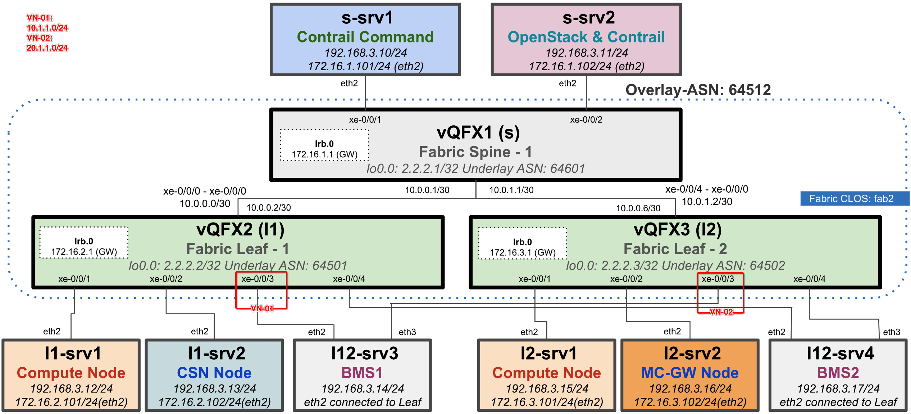
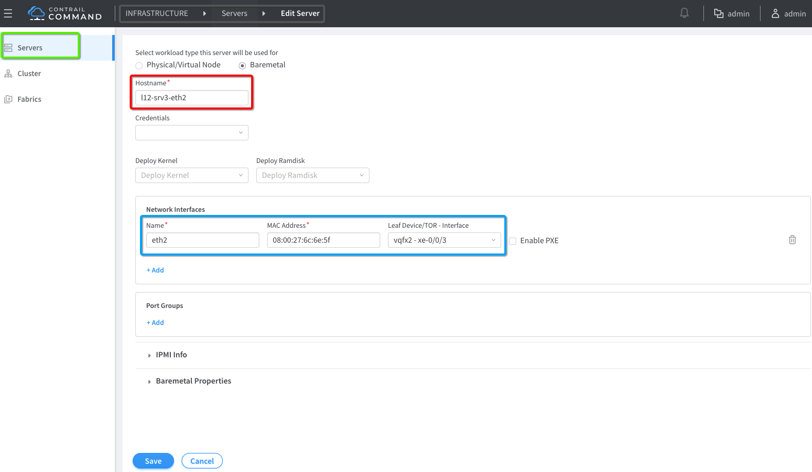
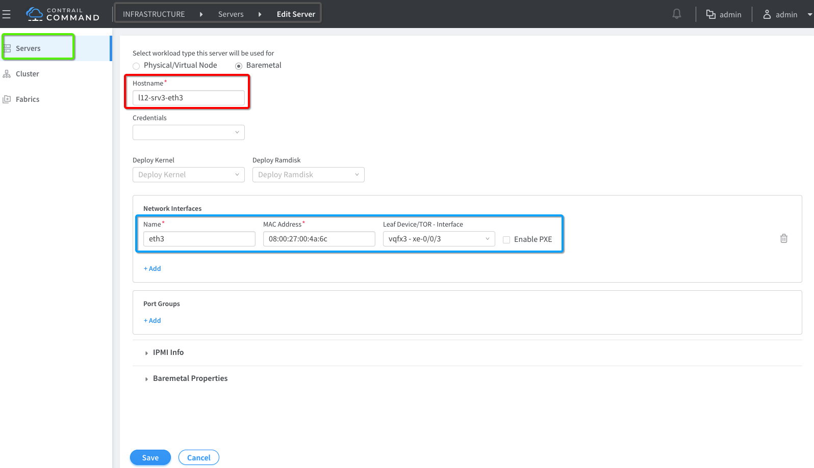
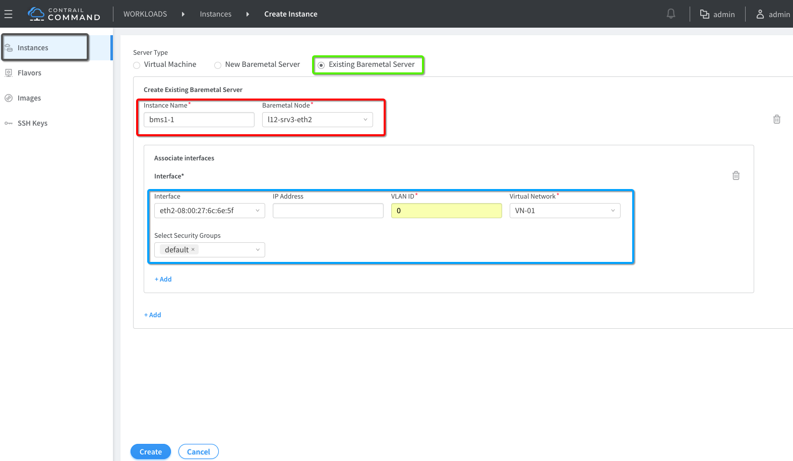
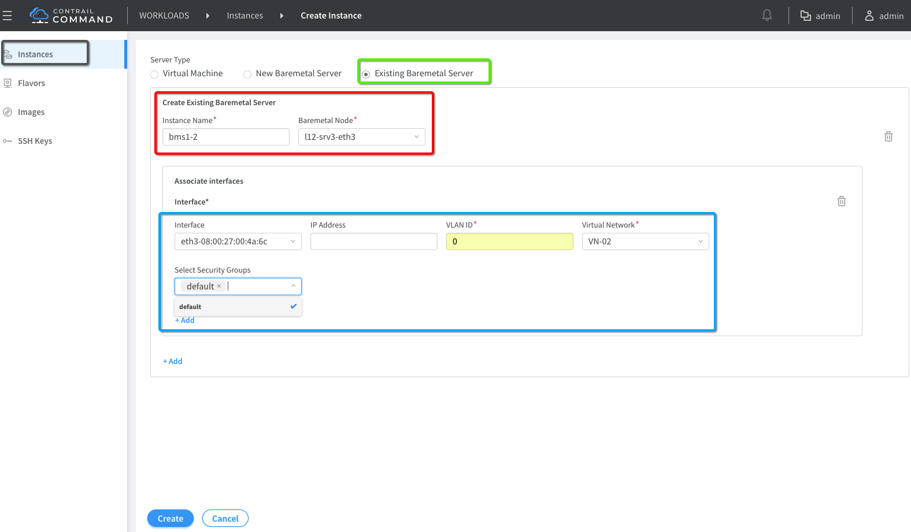

# BMS Multiple Interfaces Connection to different Leafs (TOR)

This use-case is for BMS having two interfaces connected to a separate vQFX leaf in underlay and to separate Virtual Networks VN-01 & VN-02. This use-case is only for "cem-1x2-vqfx-8srvs" topology. Here is topology high level diagram.





## 1. Add BMS server as two separate objects via Contrail Command

When BMS has two interfaces and you want to manage those two interfaces via Fabric Manager, please add each interface as a separate Server via Contrail Command GUI.

Add BMS "l12-srv3" eth2 interface




Add BMS "l12-srv3" eth3 interface




## 2. Create BMS Instances after adding the BMS servers

Once BMS server is added as two separate object for each interfaces now it's time creating BMS instances. Please create separate BMS instance for each server you cretaed in step 1.

Created BMS1-1 using l12-srv3 interface eth2



Created BMS1-2 using l12-srv3 interface eth3




## Leaf Configuration verification

l12-srv3 "eth2" connection to vQFX2 xe-0/0/3

```bash
vagrant@vqfx2> show configuration interfaces xe-0/0/3 | display inheritance no-comments | display set 
set interfaces xe-0/0/3 flexible-vlan-tagging
set interfaces xe-0/0/3 native-vlan-id 4094
set interfaces xe-0/0/3 encapsulation extended-vlan-bridge
set interfaces xe-0/0/3 unit 0 vlan-id 4094

vagrant@vqfx2> show ethernet-switching table    

MAC flags (S - static MAC, D - dynamic MAC, L - locally learned, P - Persistent static
           SE - statistics enabled, NM - non configured MAC, R - remote PE MAC, O - ovsdb MAC)

Ethernet switching table : 6 entries, 6 learned
Routing instance : default-switch
   Vlan                MAC                 MAC      Logical                Active
   name                address             flags    interface              source
   contrail_VN-01-l2-4 02:21:d7:4f:82:f2   D        vtep.32769             172.16.2.101                  
   contrail_VN-01-l2-4 02:cf:fb:ea:d6:f1   D        vtep.32770             172.16.3.101                  
   contrail_VN-01-l2-4 08:00:27:2c:49:ff   D        vtep.32772             2.2.2.3                       
   contrail_VN-01-l2-4 08:00:27:6c:6e:5f   D        xe-0/0/3.0           
   default             08:00:27:1f:d9:7f   D        xe-0/0/1.0           
   default             08:00:27:c5:c1:7b   D        xe-0/0/2.0           


vagrant@vqfx2> show evpn database               
Instance: default-switch
VLAN  DomainId  MAC address        Active source                  Timestamp        IP address
     4          02:21:d7:4f:82:f2  172.16.2.101                   Sep 05 21:15:51  10.1.1.3
     4          02:cf:fb:ea:d6:f1  172.16.3.101                   Sep 05 21:15:51  10.1.1.4
     4          08:00:27:2c:49:ff  2.2.2.3                        Sep 05 22:36:07
     4          08:00:27:6c:6e:5f  xe-0/0/3.0                     Sep 06 04:33:43

 ```

l12-srv3 "eth3" connection to vQFX3 xe-0/0/3

```bash
vagrant@vqfx3> show configuration interfaces xe-0/0/3 | display inheritance no-comments | display set    
set interfaces xe-0/0/3 flexible-vlan-tagging
set interfaces xe-0/0/3 native-vlan-id 4094
set interfaces xe-0/0/3 encapsulation extended-vlan-bridge
set interfaces xe-0/0/3 unit 0 vlan-id 4094

{master:0}
vagrant@vqfx3> show ethernet-switching table                                                             

MAC flags (S - static MAC, D - dynamic MAC, L - locally learned, P - Persistent static
           SE - statistics enabled, NM - non configured MAC, R - remote PE MAC, O - ovsdb MAC)


Ethernet switching table : 5 entries, 5 learned
Routing instance : default-switch
   Vlan                MAC                 MAC      Logical                Active
   name                address             flags    interface              source
   contrail_VN-02-l2-5 02:3a:13:76:57:db   D        vtep.32769             172.16.2.101                  
   contrail_VN-02-l2-5 02:b2:26:d5:59:4e   D        vtep.32771             172.16.3.101                  
   contrail_VN-02-l2-5 08:00:27:00:4a:6c   D        xe-0/0/3.0           
   default             08:00:27:44:f6:2f   D        xe-0/0/2.0           
   default             08:00:27:b1:6b:18   D        xe-0/0/1.0           

{master:0}
vagrant@vqfx3> show evpn database                                                                        
Instance: default-switch
VLAN  DomainId  MAC address        Active source                  Timestamp        IP address
     5          02:3a:13:76:57:db  172.16.2.101                   Sep 06 04:17:12  20.1.1.3
     5          02:b2:26:d5:59:4e  172.16.3.101                   Sep 06 04:17:13  20.1.1.4
     5          08:00:27:00:4a:6c  xe-0/0/3.0                     Sep 06 04:20:29

{master:0}
 ```


## Test Traffic

Now connect to l12-srv3 "vagrant ssh l12-srv3" and use following steps to test BMS to VM ip connectivity.

```bash
ip address flush eth2
ip address flush eth3

pkill dhclient
dhclient eth2
pkill dhclient
dhclient eth3

ip address show eth2
4: eth2: <BROADCAST,MULTICAST,UP,LOWER_UP> mtu 1500 qdisc pfifo_fast state UP group default qlen 1000
    link/ether 08:00:27:6c:6e:5f brd ff:ff:ff:ff:ff:ff
    inet 10.1.1.8/24 brd 10.1.1.255 scope global eth2
       valid_lft forever preferred_lft forever

ip address show eth3
5: eth3: <BROADCAST,MULTICAST,UP,LOWER_UP> mtu 1500 qdisc pfifo_fast state UP group default qlen 1000
    link/ether 08:00:27:00:4a:6c brd ff:ff:ff:ff:ff:ff
    inet 20.1.1.7/24 brd 20.1.1.255 scope global eth3
       valid_lft forever preferred_lft forever

ping 10.1.1.3
PING 10.1.1.3 (10.1.1.3) 56(84) bytes of data.
64 bytes from 10.1.1.3: icmp_seq=1 ttl=64 time=560 ms
64 bytes from 10.1.1.3: icmp_seq=2 ttl=64 time=102 ms
^C
--- 10.1.1.3 ping statistics ---
2 packets transmitted, 2 received, 0% packet loss, time 1002ms
rtt min/avg/max/mdev = 102.137/331.320/560.503/229.183 ms

ping 20.1.1.3
PING 20.1.1.3 (20.1.1.3) 56(84) bytes of data.
64 bytes from 20.1.1.3: icmp_seq=1 ttl=64 time=635 ms
64 bytes from 20.1.1.3: icmp_seq=2 ttl=64 time=200 ms
^C
--- 20.1.1.3 ping statistics ---
2 packets transmitted, 2 received, 0% packet loss, time 1000ms
rtt min/avg/max/mdev = 200.625/418.235/635.845/217.610 ms
 ``` 


```


