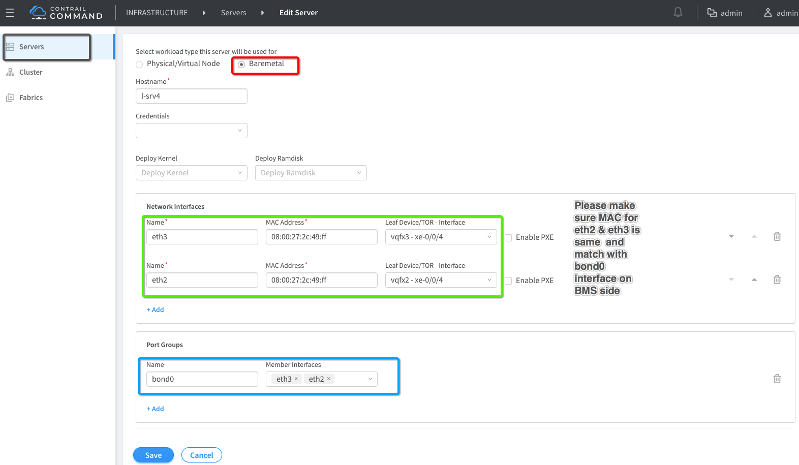
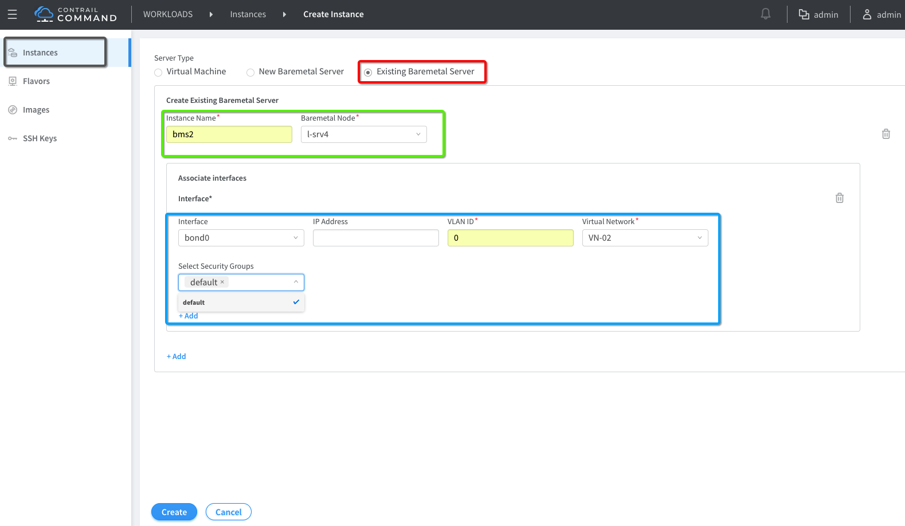

# BMS Multiple Interfaces Connection to different Leafs (TOR)

This use-case is for BMS having two interfaces connected to a separate vQFX leaf in underlay and to separate Virtual Networks VN-01 & VN-02. This use-case is only for "cem-1x2-vqfx-8srvs" topology. Here is topology high level diagram.


## 1. Add BMS server as two separate objects via Contrail Command

When BMS has two interfaces and you want to manage those two interfaces via Fabric Manager, please add each interface as a separate Server via Contrail Command GUI.

Add BMS "l12-srv3" eth2 interface



## 2. Create BMS Instances after adding the BMS servers

Add BMS "l12-srv3" eth3 interface



## Leaf Configuration verification

l12-srv3 "eth2" connection to vQFX2 xe-0/0/3

```bash
WIP

 ```

l12-srv3 "eth3" connection to vQFX3 xe-0/0/3

```bash
WIP
 ```


## Test Traffic

Now connect to l12-srv3 "vagrant ssh l12-srv3" and use following steps to test BMS to VM ip connectivity.

```bash


pkill dhclient
dhclient bond0


[root@l12-srv4 vagrant]# ping 20.1.1.3
PING 20.1.1.3 (20.1.1.3) 56(84) bytes of data.
64 bytes from 20.1.1.3: icmp_seq=1 ttl=64 time=1161 ms
64 bytes from 20.1.1.3: icmp_seq=2 ttl=64 time=262 ms
64 bytes from 20.1.1.3: icmp_seq=3 ttl=64 time=262 ms
64 bytes from 20.1.1.3: icmp_seq=4 ttl=64 time=265 ms
^C
--- 20.1.1.3 ping statistics ---
4 packets transmitted, 4 received, 0% packet loss, time 3010ms
rtt min/avg/max/mdev = 262.435/487.974/1161.824/389.049 ms, pipe 2
[root@l12-srv4 vagrant]# cat /etc/sysconfig/network-scripts/ifcfg-eth2 
#VAGRANT-BEGIN
# The contents below are automatically generated by Vagrant. Do not modify.
NM_CONTROLLED=yes
BOOTPROTO=none
ONBOOT=yes
MASTER=bond0
SLAVE=yes
DEVICE=eth2
PEERDNS=no
#VAGRANT-END
NM_CONTROLLED=no

[root@l12-srv4 vagrant]# cat /etc/sysconfig/network-scripts/ifcfg-eth3
#VAGRANT-BEGIN
# The contents below are automatically generated by Vagrant. Do not modify.
NM_CONTROLLED=yes
BOOTPROTO=none
ONBOOT=yes
MASTER=bond0
SLAVE=yes
DEVICE=eth3
PEERDNS=no
#VAGRANT-END
NM_CONTROLLED=no

[root@l12-srv4 vagrant]# cat /etc/sysconfig/network-scripts/ifcfg-bond0 
DEVICE=bond0
NAME=bond0
TYPE=Bond
BONDING_MASTER=yes
BOOTPROTO=dhcp
ONBOOT=yes
BOOTPROTO=none
BONDING_OPTS="mode=1 miimon=100"
 ``` 


```


