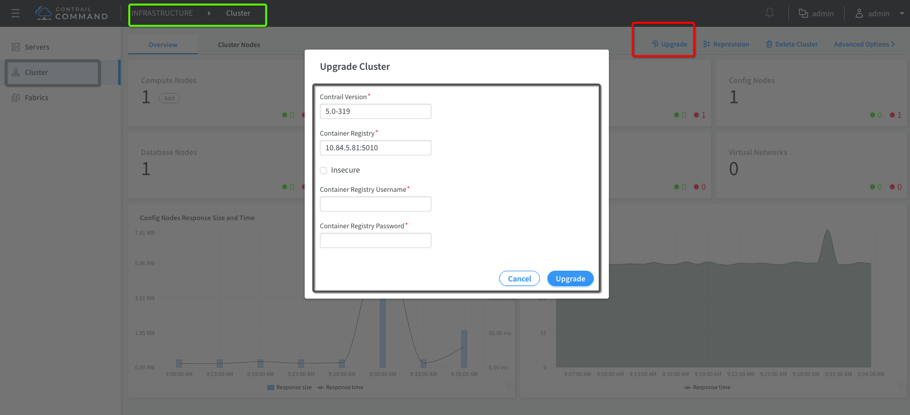

# How to upgrade Contrail Networking from one build to another build?

Starting Contrail 5.0.2 you can upgrading Contrail Networking in the existing cluster from one build to another build using Contrail Command UI.

Note: Please use 5.0.2 updated "command_servers.yml" moving forward for Contrail Command Installation and upgrade.

***Note*** Reference [New Contrail Command Servers File](https://raw.githubusercontent.com/qarham/cfm-vagrant/master/docs/scripts/5.0.2/command_servers.yml)

```bash
wget https://raw.githubusercontent.com/qarham/cfm-vagrant/master/docs/scripts/5.0.2/command_servers.yml
 ```

## Contrail Networking Upgrade

A new "Upgrade" option is available in Contrail Command UI for Contrail Networking upgrade and using this option one can upgrade Contrail Networking from one build to new build.

Here is the screenshot. You just have to provide Contrail Networking Version Build Tag and Docker registry info to start upgrade.



Once you start the upgrade you can monitor the progress by monitroing the logs.

```bash
# To minitor the progess of upgrade and for any error messages monitor following logs
docker exec contrail_command tail -f /var/log/ansible.log

 ```

## Traffic impact during upgrade

I just performed quick test to check what will be the impact on traffic and the noticed average 15-17 ICMP packets lost during the upgrade process.

Here is my test result:

```bash
# Ping acrross two compute during the upgrade total 15 ICMP packets lost
64 bytes from 10.1.1.4: seq=731 ttl=64 time=360.725 ms
64 bytes from 10.1.1.4: seq=732 ttl=64 time=167.999 ms
^C
--- 10.1.1.4 ping statistics ---
733 packets transmitted, 718 packets received, 2% packet loss
round-trip min/avg/max = 15.925/295.258/597.259 ms

# Ping acrross two compute during the upgrade total 17 ICMP packets lost
64 bytes from 20.1.1.3: seq=665 ttl=64 time=348.078 ms
64 bytes from 20.1.1.3: seq=666 ttl=64 time=303.038 ms
^C
--- 20.1.1.3 ping statistics ---
668 packets transmitted, 651 packets received, 2% packet loss
round-trip min/avg/max = 25.154/329.441/599.799 ms
 ```