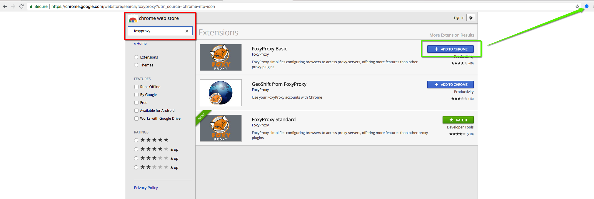
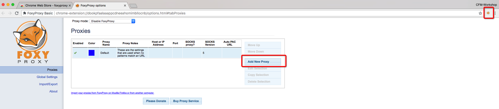
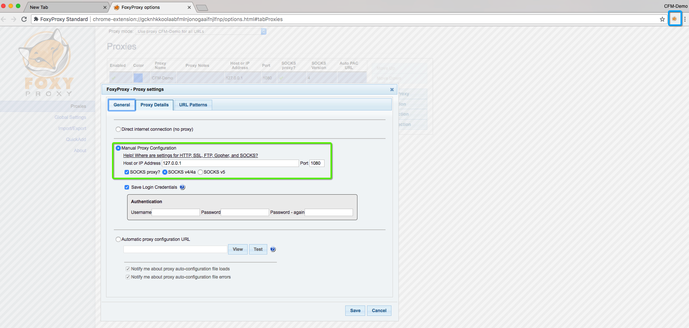

# How to setup FoxyProxy for a Chrome browser?

Here are the steps for setting up FoxyProxy in Chrome.

1. Create a new chrome profile for the workshop "CFM-Workshop" and select "No thanks" for the signin page.
   


2. Select "Chrome Web Store" and install FoxyProxy addon 
   


3. Click FoxyProxy Addon on top right and select options. After that Click on "Add New Proxy"




4. Configure new proxy profile with following parameters:
    1. Host or IP Address: 127.0.0.1
    2. Port: 1080
    3. Select "SOCKS proxy" & "SOCKS v4/v4a"
    4. Save
   


5. SSH to host with option "-D 1080"
   
```bash
# 1st step is open SSH session to the host node 
ssh root@<host-ip> -D 1080
 ```

6. Now enable FoxyProxy add-on by selecting the profile created in above step and open Contrail GUIs using IP addresses of Vagrant VMs 192.168.2.11/12

***Contrail Command GUI*** https://192.168.2.10:9091

***Contrail OLD GUI*** https://192.168.2.11:8143

***OpenStack GUI*** http://192.168.2.11

***Note***: Username/Password: admin/contrail123

## Contrail Command UI screenshot


## FoxyProxy Troubleshooting

If host OS has Selinux enabled then FoxyProxy scoks connection will not work. Please disable selinux and any iptables rules to fix this issue.

```bash

sestatus

setenforce 0

To permanently disbale “selinux” set SELINUX=disable in “/etc/selinux/config”

# cat /etc/selinux/config

# This file controls the state of SELinux on the system.
# SELINUX= can take one of these three values:
#     enforcing - SELinux security policy is enforced.
#     permissive - SELinux prints warnings instead of enforcing.
#     disabled - No SELinux policy is loaded.
SELINUX=disabled
# SELINUXTYPE= can take one of three two values:
#     targeted - Targeted processes are protected,
#     minimum - Modification of targeted policy. Only selected processes are protected. 
#     mls - Multi Level Security protection.
SELINUXTYPE=targeted

Note: Abobe file change will requried a reboot.

To disbale firewall rule use:

iptables -F

 ```

## Window Putty Destination Port Forwarding

Create a new session with the HOST IP and configure destination base port forwarding as per below screenshot. Please save the session after making the chnage.


1) Open the PuTTy client and enter the hostname and port

2) Sort in a title under Saved Sessions and press Save.

3) On the left side, go to Connection->SSH->Tunnels

4) In Source Port enter 1080 (this can be designed to be whatever you need, simply recall that it)

5) Pick the Dynamic radio button under Destination.

6) Press Add, you ought to then see D1080 in the box.

7) Go back to the session on the left side and after that press Save to save the progressions.
