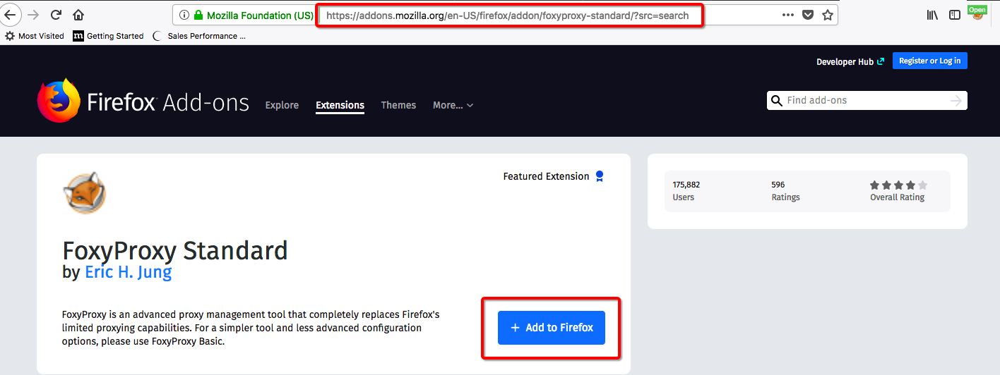
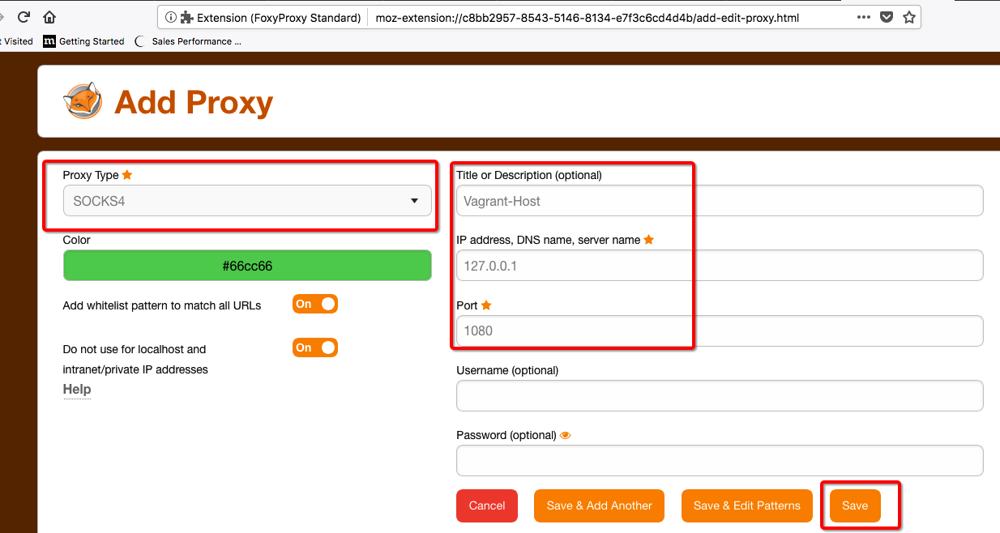
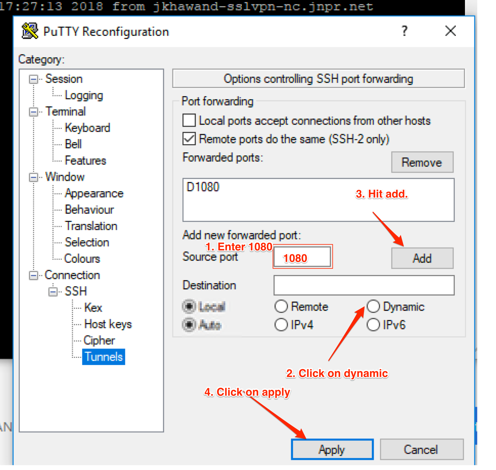

# How to setup FoxyProxy for a Chrome browser?

### Forxy Proxy for FireFox
1- Open FireFox and open https://addons.mozilla.org/en-US/firefox/ URL.
2- Search for FoxyProxy and select "FoxyProxy Standard"
3- Click on "Add to Firefox"




Now open ssh pot forwading session to Host 10.1.1.100 using port 1080. please change IP as per your host config

```bash
your-laptop> ssh root@10.87.65.30 -D 1080
```

Configure FireFox FoxyProxy add-on by configuring "127.0.0.1" & port 1080 as Scoks4 as captured in screenshot. 



Now enable FoxyProxy add-on by selecting the profile created earlier and open Contrail GUI using IP address of Vagrant VMs 192.168.2.11/12

***Contrail Command GUI*** https://192.168.2.10:9091

***Contrail OLD GUI*** https://192.168.2.11:8143

***OpenStack GUI*** http://192.168.2.11

## FoxyProxy Troubleshooting

If host OS has Selinux enabled then FoxyProxy scoks connection will not work. Please disable selinux and any iptables rules to fix this issue.

```bash

sestatus

setenforce 0

To permanently disbale “selinux” set SELINUX=disable in “/etc/selinux/config”

# cat /etc/selinux/config

# This file controls the state of SELinux on the system.
# SELINUX= can take one of these three values:
#     enforcing - SELinux security policy is enforced.
#     permissive - SELinux prints warnings instead of enforcing.
#     disabled - No SELinux policy is loaded.
SELINUX=disabled
# SELINUXTYPE= can take one of three two values:
#     targeted - Targeted processes are protected,
#     minimum - Modification of targeted policy. Only selected processes are protected. 
#     mls - Multi Level Security protection.
SELINUXTYPE=targeted

Note: Abobe file change will requried a reboot.

To disbale firewall rule use:

iptables -F

 ```

## Window Putty Destination Port Forwarding

Create a new session with the HOST IP and configure destination base port forwarding as per below screenshot. Please save the session after making the chnage.



1) Open the PuTTy client and enter the hostname and port

2) Sort in a title under Saved Sessions and press Save.

3) On the left side, go to Connection->SSH->Tunnels

4) In Source Port enter 8080 (this can be designed to be whatever you need, simply recall that it)

5) Pick the Dynamic radio button under Destination.

6) Press Add, you ought to then see D8080 in the box.

7) Go back to the session on the left side and after that press Save to save the progressions.
