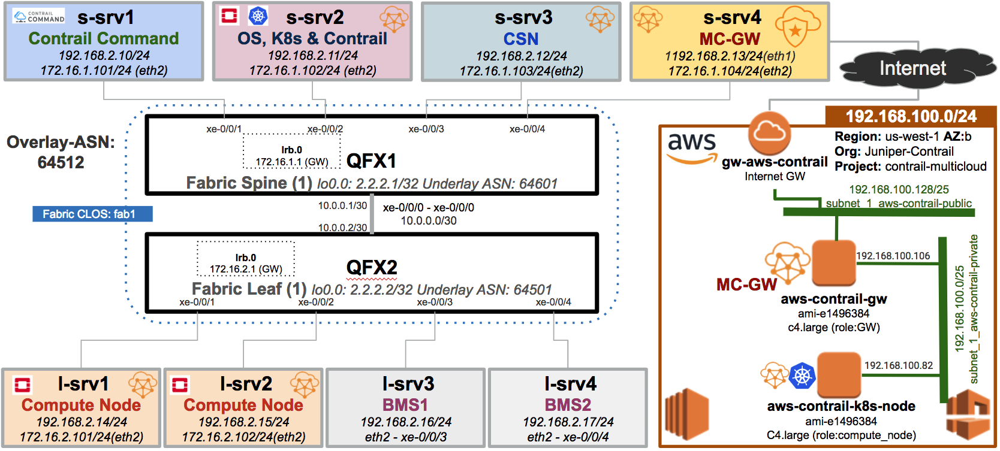
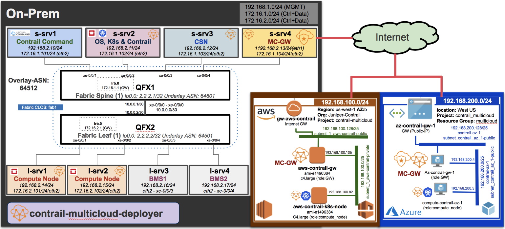

# Provisioning of Contrail Multi-Cloud via contrail-multicloud-deployer

At this stage Contrail Cluster with OpenStack is up and running after successful provisioning via Contrail Command. Now it's time starting on-prem, AWS and Azure Multi-Cloud cluster provisioning with K8s using Contrail Multi-Cloud Deployer. K8s-master will be s-srv2 and k8s-nodes will be the VMs running in AWS and Azure.

Please check the following diagram for on-prem and public cloud connectivity.

**On-prem to AWS**


**On-prem to Azure**


**On-prem to AWS & Azure**


Following Contrail SW and registry used for this setup.

* Contrail Multi-cloud SW: 5.0.2-0.360 (5.0.2GA)
* Contrail Registry: hub.juniper.net/contrail-nightly

Note: You need username/password for Juniper Registry for GA SW

## 1. Preparing Host for "contrail-multicloud-deployer"

Technically you can install "contrail-multicloud-deployer" on your laptop and trigger cluster provisioning from your laptop but in this setup private IP "192.168.2.0/24" range is used, Host server will be used for "contrail-multicloud-deployer" install and cluster provisioning.

* Host Docker Install

If docker is not installed in the host please use following commands for Docker install.

Note: The OS used for this setup is CentOS 7.5

```bash
yum install -y yum-utils device-mapper-persistent-data lvm2
yum-config-manager --add-repo https://download.docker.com/linux/centos/docker-ce.repo
yum install -y docker-ce
systemctl start docker
 ```

## 2. Install Contrail Multi-Cloud Deployer

Host server will be used for Contrail Multi-Cloud deployer. Please follow these steps:

```bash
# Login to Juniper Docker Images Registry
docker login hub.juniper.net/contrail-nightly
# Use your Username/Password

# Pull contrail-multicloud-deployer image
docker pull hub.juniper.net/contrail-nightly/contrail-multicloud-deployer:5.0.2-0.360

# Git clone Repo Branch 5.0
cd /root
git clone -b R5.0 https://github.com/Juniper/contrail-multi-cloud.git
cd contrail-multi-cloud

# Create multicloud deployer conatiner using your AWS AK & SAK
./deployer.sh -r hub.juniper.net/contrail-nightly -t 5.0.2-0.360 -v $PWD:/root/multicloud -a <Access-Key> -s <Secret-Access-Key> -k

# Check SSH key and if missing add the key
ssh-add -l
ssh-add keys/contrail-multicloud-key-XXXXX

# Login to multicloud container
ssh -o PreferredAuthentications=password -o PubkeyAuthentication=no -A root@127.0.0.1 -p 2222
cd multicloud
ssh-add -l

# Copy topology.yml file from repo 
wget https://raw.githubusercontent.com/qarham/cfm-vagrant/master/cfm-1x1-vqfx-8srv-mcloud/scripts/topology.yml
 ```

Update "CONTRAINER_REGISTRY, CONTRAINER_REGISTRY_USERNAME, CONTRAINER_REGISTRY_PASSWORD & CONTRAIL_VERSION" values in "common.yml" files under "ansible/contrail, ansible/gateway & ansible/tor".

```bash
CONTRAINER_REGISTRY: "hub.juniper.net/contrail-nightly"
CONTAINER_REGISTRY_USERNAME: <Username>
CONTAINER_REGISTRY_PASSWORD: <Password>
CONTRAIL_VERSION: 5.0.2-0.360
 ```

Before starting the cluster provisioning copy SSH key to all servers "s-srv2, s-srv4, l-srv1 & l-srv2" and test SSH connectivity without any password.

```bash
ssh-copy-id root@192.168.2.11
ssh-copy-id root@192.168.2.13
ssh-copy-id root@192.168.2.14
ssh-copy-id root@192.168.2.15

OR
ssh-copy-id  -o StrictHostKeyChecking=no -o ProxyCommand="ssh -W %h:%p -q root@192.168.2.13" root@172.16.1.102
ssh-copy-id  -o StrictHostKeyChecking=no -o ProxyCommand="ssh -W %h:%p -q root@192.168.2.13" root@172.16.1.104
ssh-copy-id  -o StrictHostKeyChecking=no -o ProxyCommand="ssh -W %h:%p -q root@192.168.2.13" root@172.16.2.101
ssh-copy-id  -o StrictHostKeyChecking=no -o ProxyCommand="ssh -W %h:%p -q root@192.168.2.13" root@172.16.2.102

# Test SSH
ssh root@192.168.2.11
ssh root@192.168.2.13
ssh root@192.168.2.14
ssh root@192.168.2.15

OR
ssh -o StrictHostKeyChecking=no -o ProxyCommand="ssh -W %h:%p -q root@192.168.2.13" root@172.16.1.102
ssh -o StrictHostKeyChecking=no -o ProxyCommand="ssh -W %h:%p -q root@192.168.2.13" root@172.16.1.104
ssh -o StrictHostKeyChecking=no -o ProxyCommand="ssh -W %h:%p -q root@192.168.2.13" root@172.16.2.101
ssh -o StrictHostKeyChecking=no -o ProxyCommand="ssh -W %h:%p -q root@192.168.2.13" root@172.16.2.102
 ```

Please delete following routes from s-srv4 where MC-GW will be provisioned.

```bash
s-srv4>
ip route delete 192.168.100.0/24 via 172.16.1.1
ip route delete 192.168.200.0/24 via 172.16.1.1

# Check above routes are deleted
ip route
 ```

## 3. Start Cluster Provisioning

Now it's time to start provisioning of the cluster as per topology highlighted in the above diagram and captured in "topoloy.yml" file.

Note: Make sure you are logged into multilcoud container, and there is a one-click-deployer folder with "deploy.sh" script to start the provisioning.

```bash
cd multicloud/one-click-deployer
# Login to Azue Portal and follow instructions
az login

# Start Cluster provisioning using following script
./deploy.sh

 ```

After sucessful provisioning login to "s-srv2" and check status of K8s clsuter.

```bash
# Change Dir to Vagrant Folder
cd /root/cfm-vagrant/cfm-1x1-vqfx-8srv-mcloud
# SSH to s-srv2 (OpenStack, K8s and Contrail Controller)
vagrant ssh s-srv2
sudo su

# Check status of K8s cluster
kubectl get nodes
kubectl get pods --all-namespaces
 ```

**On-prem/AWS & Azure topology.yml**

```bash

- provider: onprem
  organization: juniper-contrail
  project: juniper-contrail
  instances:
    - name: s-srv4
      roles:
        - gateway
      provision: true
      username: root
      password: c0ntrail123
      public_ip: 192.168.2.13
      private_ip: 172.16.1.104
      private_subnet:
        - 172.16.1.0/24
        - 172.16.2.0/24
        - 2.2.2.0/24
      interface: eth2
      vip: 172.16.2.253
      protocols:
        - ssl_client
    - name: s-srv2-controller
      roles:
        - controller: false
        - k8s_master
      provision: true
      username: root
      password: cOntrail123
      public_ip: 192.168.2.11
      private_ip: 172.16.1.102
      interface: eth2
    - name: l-srv1
      roles:
        - compute_node
      provision: false
      username: root
      password: cOntrail123
      public_ip: 192.168.2.14
      private_ip: 172.16.2.101
      interface: eth2
    - name: l-srv2
          roles:
        - compute_node
      provision: false
      username: root
      password: cOntrail123
      public_ip: 192.168.2.15
      private_ip: 172.16.2.102
      private_subnet: 172.16.2.0/24
      interface: eth2
- provider: aws
  organization: juniper-contrail
  project: contrail-multicloud
  regions:
    - name: us-west-1
      vpc:
        - name: aws-contrail
          cidr_block: 192.168.100.0/24
          subnets:
            - name: subnet_1_aws-contrail
              cidr_block: 192.168.100.0/24
              availability_zone: b
          security_groups:
            - name: all_in_aws-contrail
              ingress:
                from_port: 0
                to_port: 0
                protocol: "-1"
                cidr_blocks:
                  - "0.0.0.0/0"
            - name: all_out_aws-contrail
              egress:
                from_port: 0
                to_port: 0
                protocol: "-1"
                cidr_blocks:
                  - "0.0.0.0/0"
          instances:
           - name: aws-contrail-gw
             availability_zone: b
             roles:
                - gateway
             provision: true
             username: centos
             machine_id: ami-65e0e305
             instance_type: c4.large
             volume_size: 24
             security_groups:
                - all_out_aws-contrail
                - all_in_aws-contrail
             subnets: subnet_1_aws-contrail
             interface: eth1
             protocols_mode:
               - ssl_server
               - ipsec_server
           - name: aws-contrail-k8s-node
             availability_zone: b
             provision: true
             username: centos
             roles:
               - compute_node
             machine_id: ami-65e0e305
             instance_type: c4.large
             volume_size: 24
             security_groups:
                - all_out_aws-contrail
                - all_in_aws-contrail
             subnets: subnet_1_aws-contrail
             interface: eth0
- provider: azure
  organization: Juniper
  project: contrail-multicloud
  regions:
   - name: WestUS
     resource_group: multicloud
     vnet:
     - name: contrail-az-1
       cidr_block: 192.168.200.0/24
       subnets:
         - name: subnet_contrail_az_1
           cidr_block: 192.168.200.0/24
           security_group: allow_all_protocols
       security_groups:
         - name: allow_all_protocols-contrail-az-1
           rules:
             - name: all_in-contrail-az-1
               direction: inbound
             - name: all_out-contrail-az-1
               direction: outbound
       instances:
          - name: az-contrail-gw-1
            roles:
              - gateway
            provision: true
            username: centos
            os: centos7
            instance_type: Standard_F16s_v2
            subnets: subnet_contrail_az_1
            interface: eth1
            protocols_mode:
              - ssl_server
              - ipsec_client
          - name: compute-contrail-az-1
            username: centos
            roles:
              - compute_node
            provision: true
            os: centos7
            instance_type: Standard_F16s_v2
            subnets: subnet_contrail_az_1
            interface: eth0
 ```

### References

* <https://github.com/Juniper/contrail-ansible-deployer/wiki>
* https://github.com/Juniper/contrail-command-deployer/wiki/Using-Ansible-to-launch-the-Contrail-Command-Containers
* <https://github.com/Juniper/vqfx10k-vagrant>