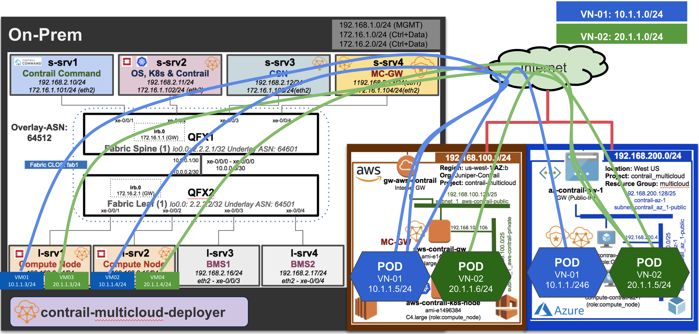
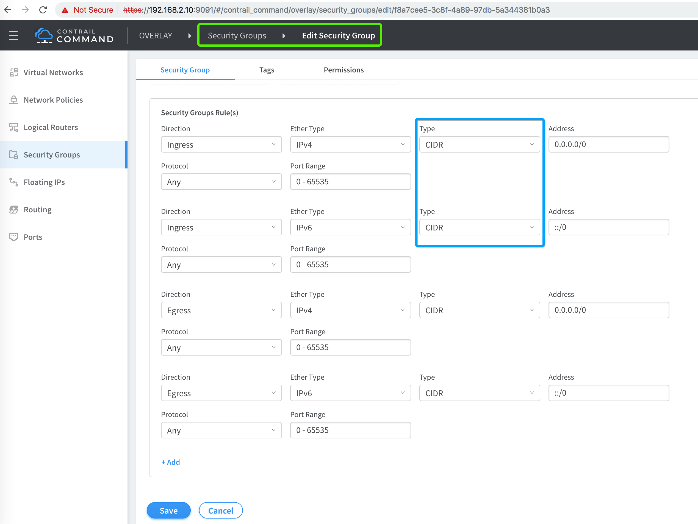

# K8s PODs & OpenStack VMs Workload Testing (Contrail as Single SDN Controller)

Now after successful provisioning of Multi-Cloud Cluster, it's time to test some PODs vs. VMs workload running in on-prem, AWS and Azure.



## 1. Create K8s PODs on AWS and Azure


```bash
mkdir demo
cd demo
wget wget https://raw.githubusercontent.com/qarham/cfm-vagrant/master/cfm-1x1-vqfx-8srv-mcloud/k8s-examples/pods/ubuntu.contrail-aws-VN-01.yaml
wget wget https://raw.githubusercontent.com/qarham/cfm-vagrant/master/cfm-1x1-vqfx-8srv-mcloud/k8s-examples/pods/ubuntu.contrail-aws-VN-02.yaml

wget https://raw.githubusercontent.com/qarham/cfm-vagrant/master/cfm-1x1-vqfx-8srv-mcloud/k8s-examples/pods/ubuntu.contrail-az-VN-01.yaml
wget https://raw.githubusercontent.com/qarham/cfm-vagrant/master/cfm-1x1-vqfx-8srv-mcloud/k8s-examples/pods/ubuntu.contrail-az-VN-02.yaml

kubectl create -f ubuntu.contrail-aws-VN-01.yaml
kubectl create -f ubuntu.contrail-aws-VN-02.yaml
kubectl create -f ubuntu.contrail-az-VN-01.yaml
kubectl create -f ubuntu.contrail-az-VN-02.yaml

# Check status of the POD
kubectl get pods -o wide
NAME              READY     STATUS    RESTARTS   AGE       IP         NODE
ubuntu-aws-vn01   1/1       Running   0          58m       10.1.1.5   aws-contrail-k8s-node
ubuntu-aws-vn02   1/1       Running   0          15s       20.1.1.6   aws-contrail-k8s-node
ubuntu-az-vn01    1/1       Running   0          4m        10.1.1.6   compute-contrail-az-1
ubuntu-az-vn02    1/1       Running   0          58m       20.1.1.5   compute-contrail-az-1

 ```

Before you test ping connectivity from PODs to VMs, please update the security groups to allow "ingress" traffic, required changes are highlighted in below screenshot.



Login to POD running in AWS and test PING connectivity to VMs running on-prem.

```bash
kubectl exec -it ubuntu-aws-vn01 bash
root@ubuntu-aws-vn01:/# ping 10.1.1.3
PING 10.1.1.3 (10.1.1.3) 56(84) bytes of data.
64 bytes from 10.1.1.3: icmp_seq=1 ttl=64 time=351 ms
64 bytes from 10.1.1.3: icmp_seq=2 ttl=64 time=362 ms

3 packets transmitted, 2 received, 33% packet loss, time 2002ms
rtt min/avg/max/mdev = 351.948/357.355/362.763/5.440 ms
root@ubuntu-aws-vn01:/# ping 10.1.1.4
PING 10.1.1.4 (10.1.1.4) 56(84) bytes of data.
64 bytes from 10.1.1.4: icmp_seq=1 ttl=64 time=275 ms
64 bytes from 10.1.1.4: icmp_seq=2 ttl=64 time=352 ms

3 packets transmitted, 3 received, 0% packet loss, time 2001ms
rtt min/avg/max/mdev = 275.667/338.435/386.798/46.500 ms


kubectl exec -it ubuntu-az-vn02 bash

root@ubuntu-az-vn02:/# ping 20.1.1.3
PING 20.1.1.3 (20.1.1.3) 56(84) bytes of data.
64 bytes from 20.1.1.3: icmp_seq=1 ttl=64 time=298 ms
^C
--- 20.1.1.3 ping statistics ---
2 packets transmitted, 1 received, 50% packet loss, time 1000ms
rtt min/avg/max/mdev = 298.014/298.014/298.014/0.000 ms

root@ubuntu-az-vn02:/# ping 20.1.1.4
PING 20.1.1.4 (20.1.1.4) 56(84) bytes of data.
64 bytes from 20.1.1.4: icmp_seq=1 ttl=64 time=376 ms
64 bytes from 20.1.1.4: icmp_seq=2 ttl=64 time=291 ms
^C
--- 20.1.1.4 ping statistics ---
2 packets transmitted, 2 received, 0% packet loss, time 999ms
rtt min/avg/max/mdev = 291.269/334.111/376.954/42.846 ms
 ```


### References

* <https://github.com/Juniper/contrail-ansible-deployer/wiki>
* https://github.com/Juniper/contrail-command-deployer/wiki/Using-Ansible-to-launch-the-Contrail-Command-Containers
* <https://github.com/Juniper/vqfx10k-vagrant>